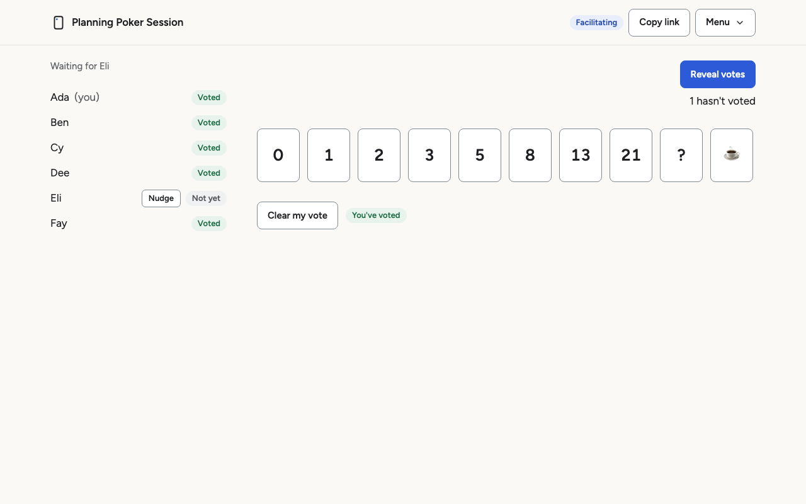
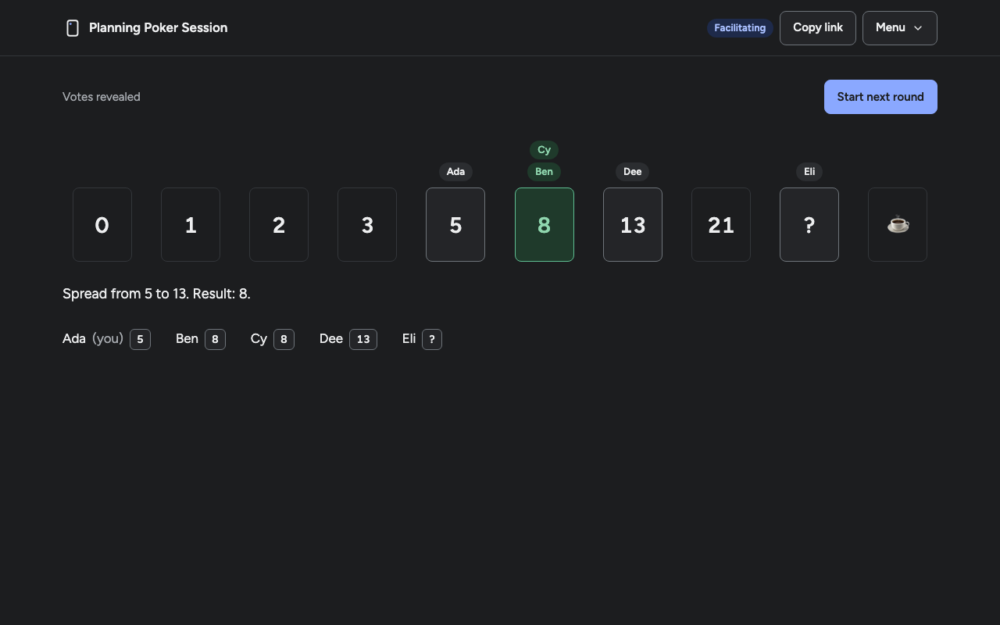
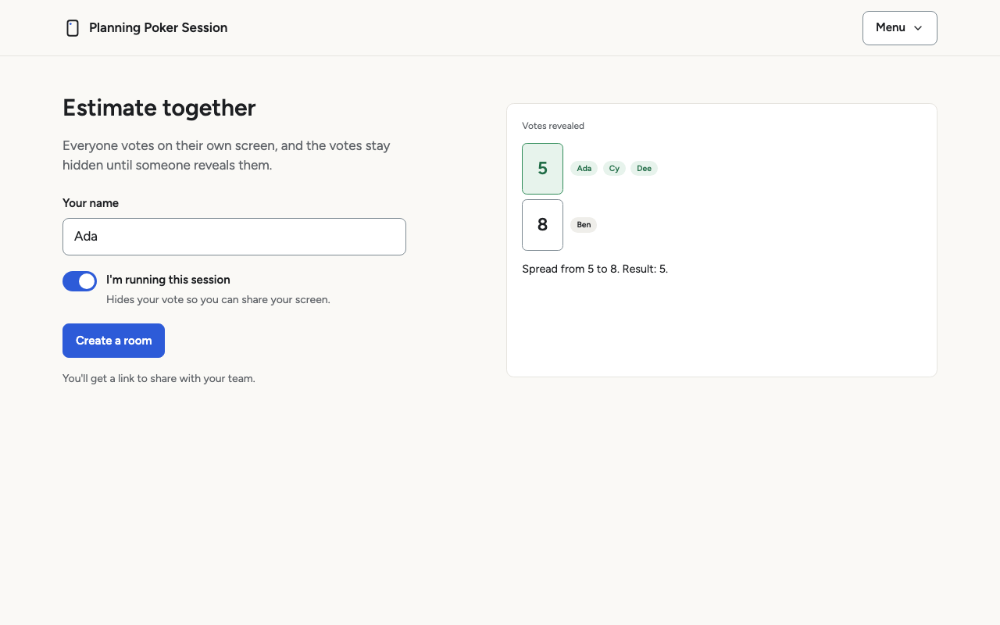
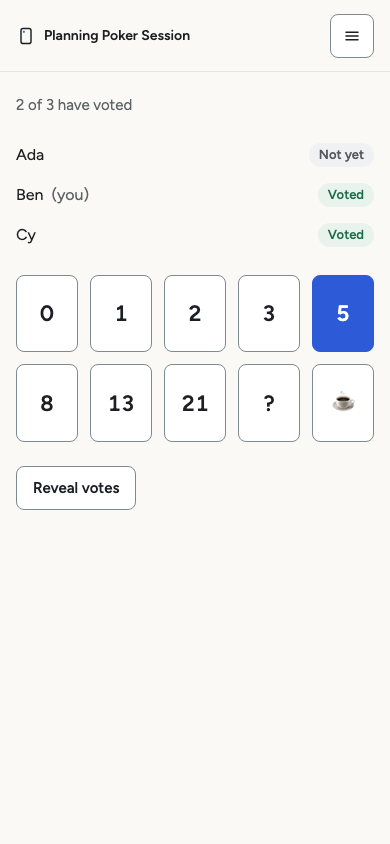
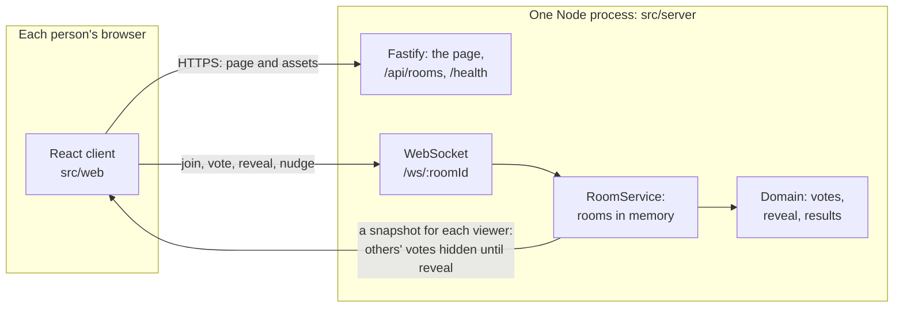
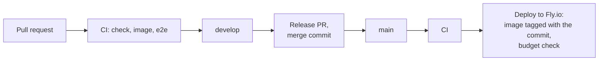

# Planning Poker Session

Real-time planning poker for a team estimating on a video call. Everyone votes on their own screen, the votes stay hidden until someone reveals them, and the result sentence gives the spread and the winner without singling anyone out.

> **Status:** early releases ([see Releases](https://github.com/ekutnik/planning-poker/releases)), about to go into use with one team. A public launch is planned for v1 (see [Roadmap](#roadmap)).

<table>
  <tr>
    <td></td>
    <td></td>
  </tr>
</table>

## Why it exists

A team estimates together on a video call, everyone on their own laptop, while the facilitator shares their screen for the whole planning session. So the app has two audiences at once: each person's own screen, and the facilitator's screen, which everyone watches as a compressed thumbnail. It is built to be calm and fast: it answers "are we waiting on someone?" in one read, stays legible over a screen share, and never shows the facilitator's own vote before the reveal unless they ask it to. The reasoning is in [docs/design.md](docs/design.md).

## Features

- **A room is a link.** Create one, share it, and everyone joins with just a name. No accounts, no install.
- **Votes stay hidden until the reveal,** on the screen and on the wire: the server sends each person only what they may see ([ADR 0004](docs/decisions/0004-vote-privacy-via-projection.md)).
- **A result sentence that singles no one out:** the spread, then the winning card or a draw, or why there is none. The deck becomes a scale, with each name above the card it chose.
- **A facilitator view** for sharing your screen: your own vote stays hidden unless you choose to show it, and the controls stay in one place.
- **The ticket being estimated,** first in the room for everyone, set in place by the facilitator once they switch Ticket name on in the Menu's Session tools.
- **A timer, if you want one:** switched on in the same place; the facilitator starts it, everyone sees it count down, and when it ends the server reveals the votes ([ADR 0008](docs/decisions/0008-the-server-holds-the-timer.md)).
- **Keep score, if you like:** a point when your vote matches the result, off until the facilitator turns it on, for the session only.
- **Nudges:** a quiet, anonymous reminder to someone who hasn't voted ([ADR 0007](docs/decisions/0007-nudges-are-transient-and-anonymous.md)).
- **It recovers on its own:** pages reconnect after a dropped connection, a laptop that wakes within a minute keeps its seat and its vote, and during a deploy each page says "The server is restarting. Reconnecting…".
- **Accessible:** light and dark themes, full keyboard and screen-reader support, checked against WCAG 2.2 AA ([Accessibility](#accessibility)).
- **Two layouts,** chosen by window width: a full window, or tiled beside the call and on a phone.

<table>
  <tr>
    <td></td>
    <td width="30%"></td>
  </tr>
</table>

## Quick start

Requires Node 24.

```bash
npm install
npm run dev       # terminal 1: the server on http://localhost:3000
npm run dev:web   # terminal 2: the client on http://localhost:5173
```

Open http://localhost:5173, create a room, and open its link in a second browser to join as someone else. Or run it as it runs in production:

```bash
docker build -t planning-poker .
docker run --rm -p 3000:3000 planning-poker   # then open http://localhost:3000
```

## How it works



- **One process holds every room in memory** ([ADR 0001](docs/decisions/0001-in-memory-room-state.md)). There is no database: a room lives as long as people are in it, and ten minutes more.
- **Every change sends each person a full snapshot of the room, projected for them** ([ADR 0003](docs/decisions/0003-full-snapshot-broadcasts.md), [ADR 0004](docs/decisions/0004-vote-privacy-via-projection.md)): nobody receives another person's vote before the reveal.
- **The client and server share one set of rules and message types** (`src/shared`), validated with Zod on the server. A client of another protocol version is told to reload.
- **Anyone in the room can reveal** ([ADR 0005](docs/decisions/0005-anyone-can-reveal.md)). A browser keeps a session token, and the room shows a public id derived from it, so a seat survives a reload without exposing the token ([ADR 0006](docs/decisions/0006-session-token-vs-participant-id.md)).
- **Limits per client address and per connection** ([ADR 0009](docs/decisions/0009-limits-per-client-address.md)), sized for a whole team behind one office address (see [Limits](#limits)).
- **Timeouts, heartbeats and grace periods run in one sweep** (see [Presence and timeouts](#presence-and-timeouts)). A shutdown closes every socket with a code the client understands, so a deploy is a short "restarting" banner, not an error (see [Shutdown](#shutdown)).

### Presence and timeouts

Every timeout runs in one periodic sweep that compares timestamps (no per-connection timers), so each deadline fires up to one sweep interval (5s) late. The room timer is the one exception: its reveal cannot be 5s late, so each running timer has one scheduled callback, checked again before it acts ([ADR 0008](docs/decisions/0008-the-server-holds-the-timer.md)).

| Rule              | Threshold               | In practice                                                               |
| ----------------- | ----------------------- | ------------------------------------------------------------------------- |
| Join timeout      | 10s without `join`      | closed after 10–15s                                                       |
| Heartbeat ping    | every 15s               | answered by the browser itself                                            |
| Heartbeat timeout | 35s since the last pong | terminated after 35–40s                                                   |
| Disconnect grace  | 60s after disconnecting | removed after 60–65s                                                      |
| Room TTL          | 10 min empty            | evicted after 10 min–10 min 5s                                            |
| Nudge cooldown    | 30s per person nudged   | exact: checked when a nudge arrives; the sweep only forgets it (ADR 0007) |

**Worst case:** a laptop whose lid closes (no FIN is ever sent) shows as disconnected 35–40s after its last pong and, absent a server stall, leaves the room at most **105s** after it (35s + 60s + two sweep intervals). Reconnecting before then reclaims the seat with the vote. A test asserts this bound.

**Server stalls.** If the server itself pauses for longer than two sweep intervals (10s), the next sweep enforces no deadline, so clients are not blamed for the server's own stall; every deadline moves back by one interval. A shorter stall goes undetected but delays pongs by at most two intervals. A healthy connection is safe as long as `PING_INTERVAL_MS + 3 × interval + RTT_MARGIN_MS < PONG_TIMEOUT_MS` (a ping can go out one interval late, its pong needs a round trip, and an undetected stall adds up to two intervals). `MAX_SWEEP_INTERVAL_MS` in `src/server/room-service.ts` is the largest interval that satisfies it (6,333 ms with the current constants), configuration rejects anything above it, and a test fails if the constants ever stop satisfying it. The heartbeat therefore either detects a stall or absorbs it.

### Limits

One client, buggy or hostile, can't flood a room, fill the server's caps or its logs on its own ([ADR 0009](docs/decisions/0009-limits-per-client-address.md)). Every number is sized for a whole team of up to 30 behind one office address, joining together and reconnecting together after a restart.

| Limit                                        | Default               | Over it                                         |
| -------------------------------------------- | --------------------- | ----------------------------------------------- |
| Messages, per connection                     | 20, then 5 a second   | `RATE_LIMITED`; past 40 refusals, closed (1008) |
| Liveness pings, per connection               | 5, then 1 every 5s    | dropped, so a flood never starves them          |
| WebSocket upgrades, per address              | 60 a minute           | closed with `1013`, retried by the client       |
| Sockets open at once, per address            | 100                   | closed with `1013`                              |
| Rooms created, per address                   | 10 an hour            | `RATE_LIMITED`, then `1013`                     |
| Commands, per address, across its sockets    | 100, then 10 a second | `RATE_LIMITED`; counts toward the 1008          |
| Room ids from `POST /api/rooms`, per address | 60 a minute           | `429` with `Retry-After`                        |

An address is the client's as `Fly-Client-IP` reports it behind Fly (never a header the client sets), and IPv6 counts by its /64. Each kind of log line a client can cause goes out at most 10 times a minute across the server, then once with a count. **This is not a defence against a distributed attack**: one small machine can't absorb one.

## Accessibility

Checked against WCAG 2.2 AA in September 2026: a self-audit, not an outside one. The record, with what was and wasn't tested, is in [docs/audit/2026-09-accessibility.md](docs/audit/2026-09-accessibility.md); the checks still due before launch are in [#44](https://github.com/ekutnik/planning-poker/issues/44).

- **Screen readers:** tested with VoiceOver in Safari.
- **Keyboard only:** tested in Chromium.
- **Screen share:** checked at thumbnail size, in a real call.
- **axe:** the end-to-end suite runs it on every screen, in both themes and both layouts, in Chromium, Firefox and WebKit, and CI fails on any violation.
- **In the design:** the deck is a toolbar of toggle buttons; focus moves to the new heading when the screen changes; the reveal is announced once; status is always a word, never only a colour; and nothing moves when motion is reduced. Details are in [docs/design.md](docs/design.md#accessibility-built-in).

## Security and privacy

- **The room link is the credential.** Room ids are 64 random bits. The id never appears in the page, the page title or the logs (which hold only a hash of it), and the link is never sent to another site (`Referrer-Policy: no-referrer`). Copy link and the address bar are the only places it shows.
- **Votes are private until the reveal,** enforced by the server's per-viewer projection, not by the client hiding them.
- **Nothing is stored on the server:** no accounts, no database. Rooms hold first names, votes, the ticket text and any points, kept in memory only, and are gone when the room empties or the server restarts. The ticket text is never logged. The browser keeps its session token, the last name used, the theme, the Facilitate setting and whether Ticket name and Timer are on, in its own storage.
- **Logs:** the server logs each request's client address, which the limits need, and each connection's opening, joining and closing; never names, votes or the ticket, and room ids only in hashed form. What people do in a room is logged only at `debug`, by message type, and production runs at `info`. The logs are Fly's, kept for Fly's retention period. Every line it writes, and its level, is in [docs/operations.md](docs/operations.md#what-the-server-logs).
- **Headers:** a strict Content-Security-Policy on every page, and HSTS in production (see [Security headers](#security-headers)).

## Development

Requires Node 24 (see `.nvmrc`). `npm install` refuses any other version (`engines` with `engine-strict` in `.npmrc`), so local results mean what CI's do.

```bash
npm install       # also installs the git hooks
npm run check     # typecheck (server and client), lint, format check, tests, client build and server build, as CI runs them
```

Run the server and the client in two terminals, then open http://localhost:5173:

```bash
npm run dev       # terminal 1: the server on http://localhost:3000, restarts on change
npm run dev:web   # terminal 2: the client on http://localhost:5173, reloads on change
```

The client's dev server proxies `/api` and `/ws` to the server, so the browser talks to one origin. Two terminals keep each process's output readable and avoid a process-runner dependency. `npm run build:web` builds the client into `dist/web`; `npm run check` and CI both run it. When a build is there, the server serves it too, as in production: open http://localhost:3000 for the built client, with its caching, compression and security headers (see Security headers below). Without one, the server is the API alone and logs that it is.

The server (`src/server`) and the client (`src/web`) have separate TypeScript configs: `tsconfig.json` is Node, with Node types and no DOM types, and `tsconfig.web.json` is the browser, with DOM types and no Node types. Both include `src/shared`, so shared code is typechecked as Node code and as browser code, and can only use what both runtimes provide. The client cannot import server code (a lint rule enforces it).

`npm install` points git at [`.githooks/`](.githooks). Its `pre-push` hook runs `npm run check`, so a push that would fail CI fails locally first. Commits are not gated, so work-in-progress commits stay cheap, and CI remains the real gate. Skip the hook once with `git push --no-verify`.

### Configuration

The server reads its settings from environment variables. Unset means the default. A set but invalid value, including an empty string, stops it from starting, with a message that names every bad variable. Numbers must be plain decimal digits (`0x10`, `1e4` and ` 5` are refused). The effective configuration is logged once at startup, so a misspelled variable, which is simply ignored, shows up as its default.

| Variable                     | Default     | Meaning                                                                                                                                                       |
| ---------------------------- | ----------- | ------------------------------------------------------------------------------------------------------------------------------------------------------------- |
| `PORT`                       | `3000`      | HTTP and WebSocket port                                                                                                                                       |
| `HOST`                       | `127.0.0.1` | The IP address to listen on. The default keeps a dev server off the network; the Docker image sets `0.0.0.0`                                                  |
| `LOG_LEVEL`                  | `info`      | `fatal`, `error`, `warn`, `info`, `debug`, `trace` or `silent`                                                                                                |
| `MAX_ROOMS`                  | `200`       | Rooms held in memory; a join that would create one more is refused. The default fits the production machine (see Deploy)                                      |
| `MAX_PENDING`                | `1000`      | Sockets that have not joined yet; more are refused with `1013`                                                                                                |
| `CONNECTS_PER_IP_PER_MINUTE` | `60`        | WebSocket upgrades, and room ids from the API, per client address a minute (ADR 0009)                                                                         |
| `SOCKETS_PER_IP`             | `100`       | Sockets open at once per client address                                                                                                                       |
| `ROOMS_PER_IP_PER_HOUR`      | `10`        | Rooms a client address may create an hour; joining a room that exists never counts                                                                            |
| `COMMANDS_PER_IP_PER_SECOND` | `10`        | Commands a second per client address, across all its sockets, after a burst of `SOCKETS_PER_IP`; joins and pings don't count                                  |
| `SWEEP_INTERVAL_MS`          | `5000`      | How often timeouts are checked (100–6333; the ceiling is `MAX_SWEEP_INTERVAL_MS`, see Server stalls)                                                          |
| `ROOM_TTL_MS`                | `600000`    | How long a room may stay empty before it is evicted                                                                                                           |
| `SHUTDOWN_TIMEOUT_MS`        | `10000`     | How long a shutdown may take before the process exits anyway, with 1 (at least 3000: the two-second close grace plus a second)                                |
| `NODE_ENV`                   | unset       | `production` makes a missing client build fatal: the server refuses to start rather than serve only the API                                                   |
| `PROXY`                      | unset       | `fly`: the server is behind Fly's proxy, so the client's address is its `Fly-Client-IP` header. Set only there: anywhere else a client could send that header |
| `WEB_ROOT`                   | `dist/web`  | Where the built client is                                                                                                                                     |

## Testing

- **`npm test`:** about 640 unit and integration tests (Vitest). They cover the domain rules, the room service with a fake clock, the server through Fastify's injection and WebSockets, the real process in a child process for configuration and shutdown, the client's components as static markup, and the stylesheets' contrast, type scale and motion rules.
- **`npm run test:e2e`:** the end-to-end suite, described next.
- **CI:** every pull request runs `check`, the Docker `image` build and its smoke test, and `e2e`. All three are required on `develop` and `main`.

### End-to-end tests

```bash
npx playwright install chromium firefox webkit   # once: the browsers
npm run test:e2e
```

`e2e/` drives the real thing in Chromium, Firefox and WebKit: the production client build, served by the compiled server with `NODE_ENV=production`, so the headers and the Content-Security-Policy are the ones users get. Playwright builds and starts it (`e2e/playwright.config.ts`). Each test makes its own room, so tests don't depend on each other and run in parallel; the restart test runs a server of its own, since it stops and starts it.

It covers:

- a full round in two browsers;
- vote privacy on the wire and on the screen;
- nudges, including that clicking "Nudged" sends nothing;
- recovery after a server restart, and a second tab;
- focus at every screen change and after Clear my vote, and the Menu's keyboard behaviour;
- a press cancelling a card's hover lift;
- the theme applied before the first paint;
- the landing preview.

axe checks every screen in the light and the dark theme, and fails on any WCAG 2.2 AA violation. Every test also fails on a Content-Security-Policy violation or an uncaught error in any page (`e2e/fixtures.ts`), and `e2e/guard.e2e.ts` proves that check sees both. In WebKit, keyboard tests press Option+Tab: like Safari by default, its Tab reaches only text fields. CI runs the suite on every pull request and keeps the report when it fails.

## Delivery



Work lands on `develop` through squash-merged pull requests. A release merges `develop` into `main` with a merge commit, and is tagged (`v0.1.0`). Any change to the protocol bumps `PROTOCOL_VERSION`.

### Docker

```bash
docker build -t planning-poker .
docker run --rm -p 3000:3000 planning-poker   # then open http://localhost:3000
docker stop -t 15 <container>
```

The image builds the client with Vite and the server with `tsc` (`npm run build:server`, into `dist/server`), then keeps only those and the production dependencies on `node:24-slim`, pinned to an exact version and digest so two builds of one commit are the same; Dependabot proposes updates as pull requests. It runs `node dist/server/main.js` directly, not `npm start`, since npm doesn't reliably pass SIGTERM on and the graceful shutdown needs it. It runs as the image's unprivileged `node` user, with `NODE_ENV=production` (so a missing client build refuses to start) and `HOST=0.0.0.0` (so the platform's proxy can reach it).

`docker stop` waits 10 seconds before it kills the process, the same as the server's own `SHUTDOWN_TIMEOUT_MS` backstop, so give it 15 with `-t 15`: then Docker never kills a shutdown that is still draining. The deploy's stop timeout is set the same way.

### Deploy

The app runs on [Fly.io](https://fly.io) (`fly.toml`): one machine in Frankfurt, always running, with 256 MB. At Fly's prices in September 2026 that is about $2.24 a month, plus $0.02/GB of traffic out. Pushing to `main` deploys, once CI has passed on that push, and only the commit CI checked (`.github/workflows/deploy.yml`); one deploy runs at a time. Its token (the `FLY_API_TOKEN` secret) is a deploy token for this app only. The image is built on GitHub's runner, and every deploy passes `--ha=false`: flyctl otherwise adds a spare machine, which would double the bill and split the rooms.

**Deploys come only from `main`, through the Deploy workflow.** Never run `fly deploy` from a laptop or a feature branch. In an emergency, re-run the latest Deploy run in GitHub Actions: it redeploys the same commit from `main`. A re-run repeats the workflow exactly as it ran then. If Actions itself is down, deploy a clean checkout of `main`. Either way, the running image always matches a commit on `main`.

**The budget:** one `shared-cpu-1x` machine with 256 MB and Fly's free shared IPv4, about $2.24 a month. As of September 2026, Fly has no spending cap and no billing alerts, so three checks stand in: a test fails if `fly.toml` asks for more (size, memory, count, auto-start, a volume, another process group or service) or drops the restart policy, the heap cap or `MAX_ROOMS`; `scripts/check-fly-budget.sh` runs after every deploy and fails on a second machine, another size, a dedicated IPv4 or a volume; and the Budget workflow runs the same check every Monday, so a change made from someone's laptop shows up as a failed run. Traffic out is $0.02/GB; the limits per address ([ADR 0009](docs/decisions/0009-limits-per-client-address.md)) keep one client from running it up, though not a distributed attack.

**Don't deploy during your team's planning sessions.** There is one machine, and rooms live in its memory (ADR 0001), so every deploy restarts it and every room loses its round in progress. Each page says "The server is restarting. Reconnecting…" and rejoins on its own within seconds, but the votes cast so far are gone and the round starts again. A second machine wouldn't help: the rooms would be split between them.

On Fly the server sends `Strict-Transport-Security: max-age=31536000` (production only; nothing for subdomains or preloading, since `fly.dev` isn't ours), Fly waits 15 s after SIGTERM (`kill_timeout`, above the 10 s shutdown backstop), checks `/health`, restarts the process if it ever exits with an error (`[[restart]]`, `on-failure`), and `PROXY=fly` takes the client's address from `Fly-Client-IP`. Memory is bounded by `MAX_ROOMS=200` and `NODE_OPTIONS=--max-old-space-size=128`: 200 full rooms (6,000 people) plus 1,000 sockets not yet joined measured 86.9 MiB of heap in a container limited to the machine's 207 MiB, where 10,000 rooms, the default until v0.5.0, ran out of heap at 400 full rooms. The code's default is 200 too, so a deploy without the setting is just as safe. A team needs a room or two.

### Shutdown

On SIGTERM (a deploy) or SIGINT (Ctrl-C), the server closes every socket with `1001`, going away, and turns away any that opens from then on with the same code, which the client reads as "The server is restarting. Reconnecting…" and answers by reconnecting with backoff. Sockets have two seconds to finish closing; any that don't answer (a closed laptop) are dropped. Then any HTTP connection still open is closed (`forceCloseConnections`): by then the rooms are gone, and what is left is either idle or, like a browser's preconnect, a connection that never sent a request, which the HTTP server would otherwise wait for until the timeout. Then the process exits with 0. A second signal, or a shutdown still running after `SHUTDOWN_TIMEOUT_MS`, exits at once with 1; the timeout can't be set shorter than the grace plus a second, or one closed laptop would fail every shutdown. Rooms are in memory and go with the process (ADR 0001): a room link still works afterwards, and the room starts empty.

### Security headers

The room link is the only credential, so the headers guard it first. Every response carries `Referrer-Policy: no-referrer`, so following a link out of the app never sends the room's URL to another site, plus `X-Content-Type-Options: nosniff` and a `Permissions-Policy` that switches off the camera, microphone, location, payment and USB. Pages carry a strict `Content-Security-Policy`: everything from this origin, nothing inline, no framing (`src/server/headers.ts`, where each directive is explained). An SVG opened directly as a page gets its own policy as hardening: no script, no requests, only its inline style. Hashed files under `/assets/` are cached for a year; everything else, `index.html` included, is revalidated on every load, so a deploy shows at once.

## Decisions

The architecture decisions, each with its context and consequences:

- [0001. In-memory room state](docs/decisions/0001-in-memory-room-state.md)
- [0002. Self-hosted WebSockets](docs/decisions/0002-self-hosted-websockets.md)
- [0003. Full snapshot broadcasts](docs/decisions/0003-full-snapshot-broadcasts.md)
- [0004. Vote privacy via per-viewer projection](docs/decisions/0004-vote-privacy-via-projection.md)
- [0005. Anyone can reveal](docs/decisions/0005-anyone-can-reveal.md)
- [0006. Session token vs. public participant id](docs/decisions/0006-session-token-vs-participant-id.md)
- [0007. Nudges are transient and anonymous](docs/decisions/0007-nudges-are-transient-and-anonymous.md)
- [0008. The server holds the timer](docs/decisions/0008-the-server-holds-the-timer.md)
- [0009. Limits per client address, sized for a team behind one NAT](docs/decisions/0009-limits-per-client-address.md)

The visual and interaction design, and the reasoning behind it, is in [docs/design.md](docs/design.md).

## Roadmap

- **Now (v0.x): Team trial.** One team uses it for its planning sessions, and what they find shapes what comes next.
- **v1 launch.** Before the repository and the link go public:
  - the scheduled budget check kept alive ([#64](https://github.com/ekutnik/planning-poker/issues/64));
  - the remaining accessibility checks ([#44](https://github.com/ekutnik/planning-poker/issues/44)), and the Safari console error ([#71](https://github.com/ekutnik/planning-poker/issues/71)).
- **Later:** named rooms ([#35](https://github.com/ekutnik/planning-poker/issues/35)).

## Credits

The typeface is [Figtree](https://github.com/erikdkennedy/figtree) by Erik Kennedy, used under the SIL Open Font License 1.1 ([`src/web/fonts/OFL.txt`](src/web/fonts/OFL.txt)).

## License

[MIT](LICENSE)
