# Design

- Status: Accepted, then revised
- Date: 2026-09-25, revised 2026-09-27

The visual and interaction design of the client, and the reasoning behind it. The architecture decisions are in [decisions](decisions); this is their counterpart for what people see.

The revision of 27 September changed the first design after a hands-on review of it: a new typeface and palette, status pills, a quieter status line, no hidden-vote field, a result the team reads by its own rule, and nudges. The revision is built over seven PRs, starting with [#46](https://github.com/ekutnik/planning-poker/pull/46) (see [Building the revision](#building-the-revision)), and each section below shows the finished screens in both themes: taken from the app at 1280×800 and 390×844, with made-up names, and kept in [`design/`](design) ([#47](https://github.com/ekutnik/planning-poker/issues/47)).

## Who it is for

A team estimates together on a video call, everyone on their own laptop. The facilitator shares their screen for the whole planning session, about two hours, switching between the issue tracker and the poker room. So the app has two audiences at once: each person's own screen, and the facilitator's screen, which everyone watches as compressed, downscaled video.

It should feel **calm and fast**: a precise tool that stays out of the way.

What follows from that:

- **Two layouts, chosen by window width.** People tile the app next to their call (compact) or give it a full window (wide). The window size is the choice, so there is no layout toggle.
- **Glanceable.** Attention is on the call. The screen answers "are we waiting on someone?" in one read.
- **Legible over a screen share.** The facilitator's view arrives as a small video thumbnail, so anything that carries meaning must survive downscaling.
- **Private on a shared screen.** Nothing on the facilitator's screen shows their own vote before reveal, unless they choose to show it, and then only until the round ends.

## Principles

- **Glanceable.** The people list answers "who are we waiting for?" in one read: each name carries a status pill.
- **One element, two jobs.** The deck is both the input and the result.
- **Calm by default.** Nothing moves because someone else acted, except the names settling onto the scale at reveal and a nudge banner appearing. With reduced motion, nothing moves.
- **Legible at thumbnail size.** Anything meaningful survives compressed, downscaled video.
- **Private on screen.** Before reveal, the facilitator view shows the viewer's own vote only if they press **Show my vote**, and it hides itself again every round. The one other visible moment is the pointer moving to a card; see [the facilitator view](#the-facilitator-view).
- **Words do one job.** One name per action. Errors say what to do and never apologise. The result names no one.

## What changed in the revision, and why

| First design                                                                               | Now                                                                                                                                   | Why                                                                                                                                         |
| ------------------------------------------------------------------------------------------ | ------------------------------------------------------------------------------------------------------------------------------------- | ------------------------------------------------------------------------------------------------------------------------------------------- |
| Atkinson Hyperlegible Next, cool paper `#F3F5F2`                                           | Figtree 400/600, warm white `#FAF9F6`                                                                                                 | Chosen side by side against Atkinson, Geist and Instrument Sans: cleaner and smoother, still clearly legible.                               |
| Dots for voted / not voted, "(away)" as text                                               | Tinted status pills: Voted, Not yet, Away                                                                                             | Readable at a glance in the list, and colour is never the only signal because each pill is a word.                                          |
| Status line bold, 18–22 px                                                                 | Status line quiet, 15 px regular, Quiet colour                                                                                        | It overshadowed the names. The pills now answer "who are we waiting for?"; the status line is supporting text. It is still the room's `h1`. |
| Masked "Your vote (hidden)" field                                                          | Removed                                                                                                                               | Decided by the team: it added clutter. The accepted consequence is under [the facilitator view](#the-facilitator-view).                     |
| The result names people ("Ada and Eli, talk through your estimates") and adds "Cy voted ?" | The result names no one: the spread, then the winner or the draw                                                                      | Everyone can see the scale; naming people adds pressure without information.                                                                |
| Outliers tinted amber                                                                      | The winning card is tinted green, a draw amber, found by the team's rule: drop one vote at each end, then take the card with the most | The team's own rule for reading a round.                                                                                                    |
| Compact reveal lists all ten cards                                                         | Compact lists only the cards that got votes                                                                                           | All ten barely fit a phone-height window. Wide keeps every step, where the gaps show the spread.                                            |
| No nudge                                                                                   | Facilitators can nudge people who haven't voted                                                                                       | Saying names aloud on the call is exactly the pressure the tool should remove.                                                              |
| "Planning poker"                                                                           | "Planning Poker Session", with a card mark                                                                                            | The product name, capitalised as a name. The rest of the interface stays in sentence case.                                                  |

## The memorable element: the deck is the scale

Before reveal, the deck row is where you choose. After reveal, the same row becomes the result: each person's name sits above the card they chose. Consensus is everyone stacked on one card; a wide spread visibly stretches across the deck. There is no separate results panel. Spread is measured in deck steps, and nothing is shown that does not map back to a card.

- **Wide:** all ten steps across the full width. Names sit above their card as pills, stacked upwards; the stack grows to fit, and a name never shrinks or is cut mid-name. Every card shares one baseline. Empty steps keep a Rule outline and an Ink numeral, so the gaps show the spread and the numbers along the scale still read as its axis ("from 3 to 13") over a compressed share.
- **Ten across needs room for a name.** A pill holding a long word ("Oppenheimer") is about 100 px, so the scale lays all ten steps across only when it has ten 100 px columns and nine 12 px gaps (1108 px), which the full 1120 px column gives from a 1204 px window up (a classic scrollbar adds its own width to that). Narrower, it uses the compact rows: **windows between 880 and about 1204 px get the row layout,** every name whole, but without the gaps that show the spread. The facilitator shares a full laptop window, which is wider: a 13.6-inch MacBook Air at its default scaling gives a 1470 px full window, which gets ten across (checked). The scale's own width decides, through a container query, like the deck's; the 1108 px is derived from the column in a test, not written down twice.
- **A long name wraps inside its pill,** between words, and is never hyphenated: an inserted hyphen reads as part of the name (Anne-Marie has a real one), and hyphenation rules do not know names. As a last resort `overflow-wrap: anywhere` breaks a word that cannot fit a line on its own, with no hyphen, so nothing spills out of its column (a 32-character name with no spaces takes three lines at 1470 px). The pill keeps a wrapped name one person, which is what the one-line rule after A-04 was for, before names had pills; its corners are 12 px, half the one-line height, so a wrapped pill is a rounded box rather than an oval.
- **Compact:** only the cards that got votes, in deck order, one row each: the card, then its name pills wrapping beside it.
- **Colour lives on the scale only:** the highlighted card or cards and the name pills above them. The value chips in the people list stay neutral.
- **Names sit above every card, numeric or not.** The scale is itself a list a screen reader can read ("question mark: Cy"); in the DOM each step is the card, then its names in join order, and CSS draws the names above the card.

## Tokens

Defined in [`src/web/styles/tokens.css`](../src/web/styles/tokens.css) as CSS custom properties. Each colour is defined once with its light and dark value through `light-dark()`, and `color-scheme` chooses between them. No shadows, grain or gradients anywhere.

### Colour

| Token     | Light     | Dark      | Job                                                      | On Paper (light / dark) |
| --------- | --------- | --------- | -------------------------------------------------------- | ----------------------- |
| Paper     | `#FAF9F6` | `#1C1D1F` | Page background                                          | —                       |
| Surface   | `#FFFFFF` | `#242528` | Cards, inputs, the menu panel                            | —                       |
| Ink       | `#1D1F22` | `#EDEEEF` | Text, card numerals                                      | 15.7 / 14.5             |
| Quiet     | `#5F6368` | `#A7ABB0` | Status line, secondary text                              | 5.8 / 7.3               |
| Rule      | `#E6E4DF` | `#33363A` | Dividers, outlines of empty scale cards; decoration only | 1.2 / 1.4               |
| Edge      | `#7D8A92` | `#6E747A` | Outlines of controls: cards, buttons, inputs             | 3.4 / 3.6               |
| Cobalt    | `#2D5BD8` | `#8AA8FF` | Selection, focus ring, primary button                    | 5.5 / 7.3               |
| On Cobalt | `#FFFFFF` | `#1C1D1F` | A label on a Cobalt fill (5.8 / 7.3 on Cobalt)           | —                       |

Pills and banners, background / text:

| Token        | Light                 | Dark                  | Used for                                   | Text on background (light / dark) |
| ------------ | --------------------- | --------------------- | ------------------------------------------ | --------------------------------- |
| Voted        | `#E7F3EC` / `#1F6B45` | `#1F3A2B` / `#8FD6AE` | "Voted", "You've voted", winner name pills | 5.7 / 7.3                         |
| Not yet      | `#F0F1F2` / `#55595E` | `#2B2D30` / `#B7BBC0` | "Not yet"                                  | 6.2 / 7.2                         |
| Away         | `#FBEAEA` / `#A12A2A` | `#402426` / `#F3A9A9` | "Away"                                     | 6.3 / 7.4                         |
| Draw         | `#FBF1E0` / `#8A5A12` | `#3A2F1C` / `#E8C07A` | Draw name pills                            | 5.3 / 7.6                         |
| Name         | `#EFEEEA` / `#1D1F22` | `#2B2D30` / `#EDEEEF` | Neutral name pills on the scale            | 14.2 / 11.9                       |
| Facilitating | `#E8EEFC` / `#2448B0` | `#1E2A4A` / `#AAC0FF` | The header pill, the nudge banner          | 6.9 / 7.9                         |

Scale cards after reveal, fill / border / numeral:

| Token | Light                             | Dark                              | Border on Paper (light / dark) |
| ----- | --------------------------------- | --------------------------------- | ------------------------------ |
| Win   | `#E7F3EC` / `#2E8B57` / `#1F6B45` | `#1F3A2B` / `#5FBF93` / `#8FD6AE` | 4.0 / 7.5                      |
| Draw  | `#FBF1E0` / `#A8761F` / `#8A5A12` | `#3A2F1C` / `#E0A84A` / `#E8C07A` | 3.8 / 7.9                      |

- **Colour is never the only signal.** Every pill is a word, the result is a sentence, and "away" is a word.
- **Two contrast tiers, in both themes.** Meaning (text, and every pill's text on its background) is at least 4.5:1; the lowest pair is Draw text on its pill in light, 5.3:1. Boundaries (Edge on Paper and on Surface, Cobalt as the focus ring, the tinted cards' borders) are at least 3:1, so a highlighted card stays a card over a compressed share; the lowest is the light Draw border, 3.78:1. Rule stays below 3:1, so it cannot stand in for Edge. A test parses the stylesheet and enforces all of it.
- **Edge marks controls.** WCAG's non-text contrast criterion (1.4.11) needs 3:1 for what identifies a control; Rule cannot give that.

### Themes

- A **System / Light / Dark** choice in the header's Menu, defaulting to System and remembered in `localStorage`. A choice made in one tab applies in every open tab.
- A `data-theme` attribute on `<html>` pins `color-scheme`, and so overrides `prefers-color-scheme`.
- **Known limitation:** each colour is defined once with `light-dark()`, which needs a 2024-or-later browser (Chrome 123, Firefox 120, Safari 17.5). Older browsers treat the colour tokens as invalid and fall back to their default black on white: readable, not broken. Accepted for a tool used in current browsers.
- **Known limitation:** the landing preview is shrunk to 80% with CSS `zoom`, which Firefox supports from 126 (May 2024; Chrome and Safari for years). In an older Firefox the preview shows at full size: cramped beside the form, but readable, and it is decoration only.
- **No flash of the wrong theme.** [`src/web/public/theme-init.js`](../src/web/public/theme-init.js) applies the stored choice before the first paint. It **must stay a plain, blocking `<script src>` in `<head>`: not `type="module"`, not `async`, not `defer`**, or the flash comes back. It is external rather than inline so that a Content-Security-Policy of `script-src 'self'` allows it with no hash to keep in sync. A test runs it and checks it applies exactly what the app would.

### Type

One family: **Figtree**, in weights 400 and 600.

- **Self-hosted**, with no third-party request: it works offline and avoids the GDPR concerns of loading fonts from a third party's servers. The variable font covers both weights in one file per subset: Latin (20 KB) always, and Latin Extended (10 KB) only when a name on screen needs one of its characters (`unicode-range`).
- **No flash of the system font:** the page preloads the Latin file, so Figtree is usually there for the first frame. Latin Extended is not preloaded; it only matters when a name needs it.
- The files are the upstream Fontsource 5.3.0 builds, **used exactly as published: never subset or altered here**. They are licensed under the SIL Open Font License 1.1 ([`src/web/fonts/OFL.txt`](../src/web/fonts/OFL.txt)), which declares no Reserved Font Name.
- **Sentence case everywhere,** except the product name, "Planning Poker Session". No all-caps labels.

| Role                            | Compact         | Wide            |
| ------------------------------- | --------------- | --------------- |
| Body                            | 16 / 400        | 17 / 400        |
| Room status (`h1`)              | 15 / 400, Quiet | 15 / 400, Quiet |
| Landing and join heading (`h1`) | 26 / 600        | 30 / 600        |
| Card numerals, deck             | 22 / 600        | 26 / 600        |
| Card numerals, scale            | 17 / 600        | 28 / 600        |
| Result sentence                 | 17 / 400        | 18 / 400        |
| Pills, nudge button             | 13 / 600        | 13 / 600        |
| Wordmark                        | 14 / 600        | 17 / 600        |
| Controls (buttons, Menu labels) | 15 / 600        | 15 / 600        |
| Small (a switch's description)  | 14 / 400        | 14 / 400        |
| The ticket being estimated      | 17 / 600        | 20 / 600        |
| The ticket while editing        | 16 / 600        | 16 / 600        |
| The timer's numerals            | 17 / 600        | 17 / 600        |
| Labels ("Now estimating")       | 12 / 400        | 12 / 400        |
| The Menu's group names          | 12 / 600, Quiet | 12 / 600, Quiet |

Sizes are px, set in `rem`, so browser zoom scales them. A test checks every role against this table. The numerals are smaller than in the first design, so the screen-share legibility check was repeated: on 2026-09-29, in a real call, with the result "All good." ([the audit record](audit/2026-09-accessibility.md#before-launch-44-2026-09-29)).

### Shape and space

- **Corners:** 8 px on cards, buttons and inputs; 12 px on containers (the menu panel, the preview frame, the nudge banner); fully round on pills; 6 px on value chips and the small buttons.
- **Three control heights in the room, and no others:** 44 px for Reveal votes, Start next round, Copy link, Menu, and the landing and join buttons; 40 px for Clear my vote, Show my vote, the timer block and the ticket field while editing; 28 px for the small tools: Nudge, Edit, Add a ticket, the timer's buttons and +30 s, Save and Cancel. A browser test measures every control in the voting and revealed views against them.
- **Cards are 4:5.**
- **Spacing steps:** 4, 8, 12, 16, 24, 32, 48, 80 px (`--space-4` … `--space-80`). **One exception:** 28 px between the room's action row and the deck (and the people list beside it), the redesign's own figure, kept rather than rounded to 24 or 32. The room's two columns are 48 px apart: the redesign's notes asked for 56, but at 56 the deck gets 784 px at full width, 4 px short of ten cards in a row.
- **Content is a contained column,** at most 1120 px.

## Layout

- **One component tree.** Compact and wide are switched by CSS grid areas at `55em` (880 px). There is no duplicated markup, and the reading order for keyboards and screen readers is the same in both.
- **Left-aligned text,** in a contained column. Sections are separated by space; containers (the menu panel, the preview, the nudge banner) are the only boxes.
- **Participants keep join order** and never reshuffle.
- **The title is the product's name,** "Planning Poker Session". Rooms have no names yet ([#35](https://github.com/ekutnik/planning-poker/issues/35)), and the room id is never shown in their place: it is the room's credential, and the facilitator's screen is shared, possibly recorded, for the whole session.
- **Every screen has one `h1`.** In the room it is the status line ("Waiting for Ben and Cy. Fay is away.", "Votes revealed"), the thing a screen reader user most wants to jump to, styled quiet. It is not a live region, so its changing text never chatters.
- **The browser tab's title names the screen,** and in the room it carries the round: "2 waiting – Planning Poker Session", "Everyone voted – …", "Votes revealed – …". A facilitator in the issue tracker's tab can see whether everyone has voted without switching back. Only what everyone can see: never a vote, never the room id. A nudged participant's tab reads "Your vote, please – Planning Poker Session".

## Components

### Header

<table><tr><td>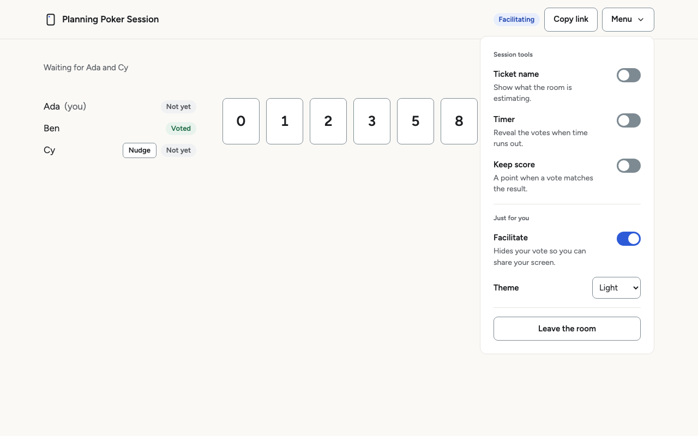</td><td>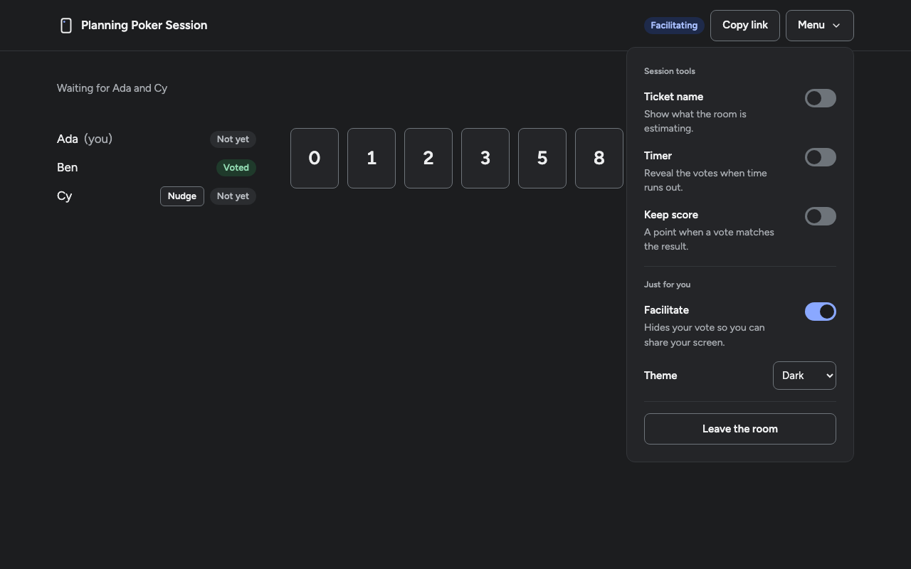</td></tr></table>

- **Left:** the mark (a card with an index dot in Cobalt; its outline follows the text colour) and "Planning Poker Session". The mark is 26 px wide, 20 px compact.
- **Right:** the "Facilitating" pill (only while on), Copy link, Menu. In compact, Menu is an icon button (three bars) with `aria-label="Menu"`; in wide it reads "Menu" with a chevron. Outside a room there is no pill and no Copy link, and the Menu holds Theme alone.
- **Copy link moves into the Menu in compact,** as its first item, above Facilitate, so the pill and the Menu fit beside the name in one row: a second header row would cost about 72 px where height is scarcest, and Copy link is used once a session, by whoever creates the room. It says "Link copied" there, and the panel stays open to show it. When the browser refuses the copy it says "Couldn't copy. Copy the address from your browser." instead; either message shows for three seconds, and both are announced through the button's own live region, since a focused button whose text changes is not reliably read out. It is rendered in one place or the other, chosen in script at the same 55em breakpoint, never in both with one hidden by CSS, so a screen reader never finds two.
- **The frame:** the header spans the window with its Rule line underneath; its content, and each screen's content below it, sit in one column of at most 1120 px. At 320 px (400% zoom) the header wraps onto two rows, the controls kept at the right edge so the Menu's panel stays on screen.
- **Menu** is a disclosure: a button that shows a panel, not an ARIA menu (it holds mixed controls) and not a dialog (a dialog would move and trap focus and make the rest of the page inert, none of which fits a small settings panel). In the facilitator view, two groups:
  1. **"Session tools"** (12 px, 600, Quiet): **Ticket name**, "Show what the room is estimating."; **Timer**, "Reveal the votes when time runs out."; **Keep score**, "A point when a vote matches the result." Each is a switch (`role="switch"`) with its description. The Menu's descriptions are at most 192 px wide (`12rem`), so they read as short lines: "Reveal the votes when time / runs out.", "A point when a vote matches / the result." at the default size; at other sizes a line may break a word earlier, which is fine.
  2. A divider, then **"Just for you"**: Facilitate, a switch, with "Hides your vote so you can share your screen."; then Theme: System / Light / Dark, a native select.
  3. A divider, then "Leave the room".

  Each group's name is a small paragraph that names a `role="group"`, not a heading: the Menu comes before the room's `h1` in the page. In the participant view the Menu is as it was: Facilitate, Theme, a divider, then "Leave the room", with no group names.

- **Ticket name and Timer are this browser's settings,** like Facilitate, stored together under `planning-poker:tools:v1`, and off until this browser turns them on. They decide only which controls the facilitator view shows: a ticket or a running timer reaches everyone, whatever their own settings say. Keep score is different: it is the room's setting, held by the server.
  - **Ticket name on** gives the facilitator view Add a ticket or the pencil that edits it. **Switching it off while a ticket is set clears the ticket for the room** (`setTicket` with empty text, the existing message), so nobody sees a ticket nobody is managing. A ticket set from another browser still shows, read only. It waits for the room while it reconnects, like Keep score, since off may need the room.
  - **Timer on** gives the facilitator view the timer block. While a timer runs or is paused, the switch is held on, disabled, and its description reads "Available once the timer has stopped.": switching it off would hide the controls of a timer that is still counting. The timer stops by itself at every reveal. Switched off, a timer started from another browser still shows, read only, and switching it on gives its controls.
- **How the Menu behaves:** the button has `aria-expanded` and `aria-controls`, and the panel comes straight after it in the page, so the next Tab after opening goes into the panel; opening does not move focus. It closes on Escape (focus returns to the button), on a click outside, and when focus moves out of both the button and the panel. Escape works wherever focus is while it is open, because Safari does not focus a button on click. Toggling Facilitate or changing the theme leaves it open, so the result can be seen.
- **Favicon:** the mark as an SVG, plus a 32 px PNG for browsers without SVG icons. At 16 px the header's 1.75 outline blurs away, so the favicon alone frames the card tighter and draws it at 2. The PNG fills the card white, so it shows on a dark tab bar too. **The SVG's dark stroke follows the computer's dark mode, not the theme chosen in the Menu:** a tab icon cannot read the page's setting, so someone on a light computer who picked Dark keeps the light icon. That is expected, not a bug.

### People list

- One row per participant in join order: the name, then a status pill: Voted, Not yet, or Away.
- **Someone away who has voted shows Voted, not Away.** Their vote counts, so they are not holding anyone up; Away is only useful for someone who has not voted. The status line counts them the same way.
- The viewer's own row is included, with "(you)" after the name in Quiet. A long name is cut short with "…", but "(you)" never is: it sits outside the name and does not shrink, since it is what tells you which row is yours.
- In the facilitator view, a **Nudge** button sits before the pill of every connected participant who hasn't voted (not for away people, not for yourself). Its accessible name includes the person: "Nudge Cy". After a nudge it reads "Nudged" for 30 seconds (the shared `NUDGE_COOLDOWN_MS`), or until they vote or the round ends, the moments the server's cooldown ends too. "Nudged" is `aria-disabled`, not `disabled`, so it keeps keyboard focus in every browser, and a click on it does nothing. If a focused Nudge button goes, because its person voted or left, focus moves to the people list (focusable from script, not a Tab stop) rather than falling to the page.
- After reveal, in wide only, the list moves below the sentence, as a row that wraps: each person with a neutral value chip; without a vote, a pill in words: "Away" for someone away, "No vote" (Not yet colours) for someone here.
- **Compact leaves the revealed list out,** to save height: the scale lists every vote. The trade-off: someone here who did not vote appears nowhere after reveal in compact. Accepted for now, because the person sharing their screen uses the wide layout, where everyone is listed; revisit after dogfooding if anyone misses it.

### Deck (voting)

- One row of ten 68 px cards when the deck has room for them (788 px); two rows of five otherwise, which is always the case in compact. The deck's own width decides, through a container query, because in wide the room for it depends on the window.
- **States:** default (Surface, 1.5 px Edge outline); hover, only on a device that can hover (Ink outline, except on the selected card, which keeps its Cobalt outline so the hover does not read as a third state; and a 2 px lift only when motion is allowed: with reduced motion nothing moves; on a phone a tap would leave the hover on the card, where it reads as a selection); selected (Cobalt fill, On Cobalt numeral); focus (3 px Cobalt ring, 2 px outside); selected and focused shows both.
- **A toolbar of toggle buttons** (`aria-pressed`), not a radiogroup: a radiogroup selects on arrow keys, which here would cast and broadcast a vote on every keypress. Arrow keys move between cards, Space or Enter chooses, and Tab moves past the whole deck in one step.
- In the facilitator view, no card is ever shown as selected.

### The room's layout

<table><tr><td>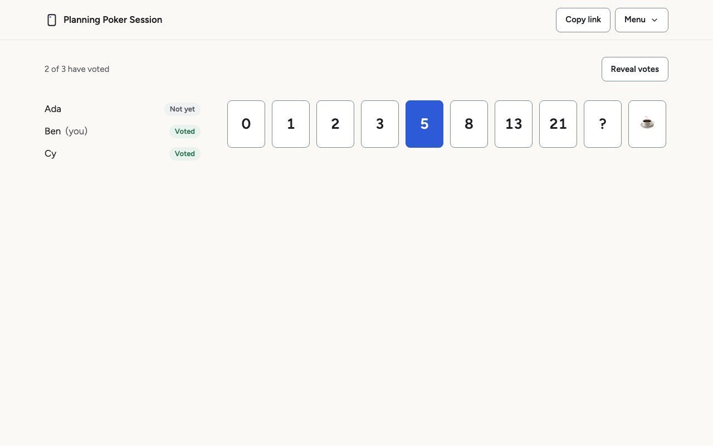</td><td>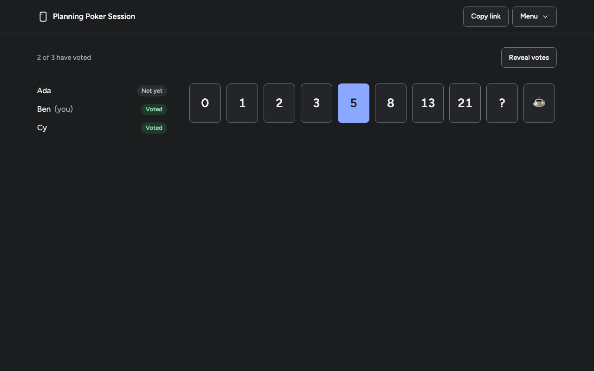</td></tr></table>

<table><tr><td width="45%"></td><td width="45%">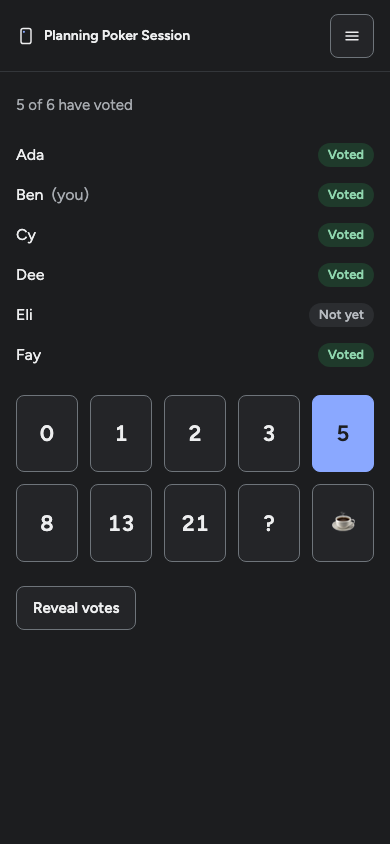</td></tr></table>

**Fixed slots: nothing moves when a tool is switched on or off.** In wide, the deck, the round's action and the people list stay exactly where they are, whatever is switched on and whatever the tools are doing. A browser test records their positions with every tool off, then switches on Ticket, Timer and Keep score, starts the timer, adds a ticket and edits it, checking after each step, to the pixel; and the same for a participant as a ticket and a running timer arrive.

- **Wide:** two columns, as before: the status line and the people list on the left, 280 px; the round on the right, 48 px away. (The redesign's notes asked for 56 px, but that leaves the deck 784 px at full width, 4 px short of ten cards in a row, so the gap stays 48.)
- **The action row** is the right column's first row, 56 px, for everyone and whatever is switched on: the ticket slot, which fills the space; the timer block; then Reveal votes or Start next round. Everything in it is centred vertically. **Its height comes from the ticket slot,** which is always in the page and always 56 px, empty or not: that reserved height is what keeps everything else still. Custom… widens the timer block, and the ticket slot gives up the room; nothing moves vertically.
- **A narrower wide window** (below about 1030 px, where the room is under 936 px): the action row cannot hold a ticket being edited beside the timer and the action, so the ticket slot takes a row of its own above them, the timer and the action right-aligned below it. Both rows are always there at that width, empty or not, so nothing moves there either; the status line lines up with the ticket's row. The room's own width decides, through a container query. The browser test runs at 880 px as well as 1280, and also checks that no part of the action row overlaps another.
- **The status line** (`h1`) sits in a 56 px box of its own at the top of the left column, its text centred in it, so its centre is the action row's; a test holds them to within 1 px. The status line and the people list are one column of their own, spanning every row on the right, so a long "Waiting for …" that wraps pushes only the people down, never the deck.
- **Then** the deck, 28 px below the action row, and the people list level with it; then, in the facilitator view, your own vote.
- **There is no "N hasn't voted" line any more:** the facilitator's status line already names who is missing.
- **Wide, after reveal:** the same action row, with Start next round where Reveal votes was, then the scale across both columns, the sentence, and the people.
- **Compact (a phone):** one column in reading order. First, **a block with the ticket and then the timer block, only while there is something in it,** set apart by a rule: for a participant, a ticket that is set or a timer that runs or is paused; in the facilitator view, also the tools switched on. Then the status line, people, deck, your own vote and the controls, with the facilitator's controls pinned to the bottom when the window is tall enough. The pinned bar is 72 px (a 44 px button, 12 px above and below, a 1 px rule), and focus scrolls clear of exactly that; a test holds the button, the padding and the rule to the height reserved.
- **On a phone the room moves down once when the first tool appears.** Reserving the block's height would cost too much of a phone's screen for something most rounds may not use, so on a phone, unlike in wide, the room moves down when the first of the ticket and the timer appears, and back up when the last goes.
- **Keyboard order** follows the slots: the ticket's Edit, the timer, the people's Nudge buttons, the deck, your own vote, and the round's action last, so the order still follows the task (read the status, see who is in, vote, then reveal).

### The ticket

<table><tr><td>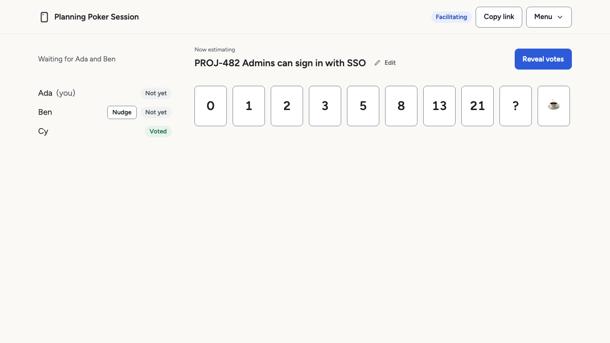</td><td>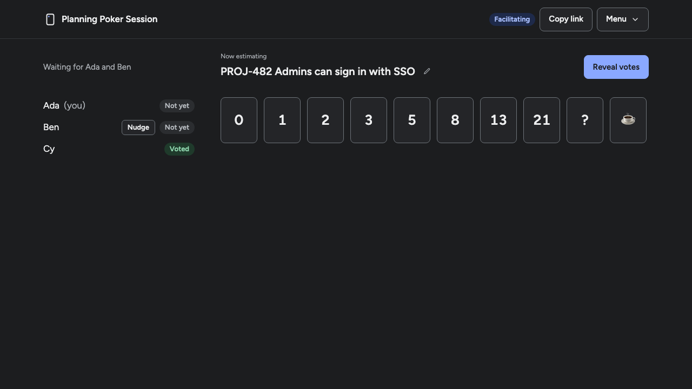</td></tr></table>

<table><tr><td width="45%">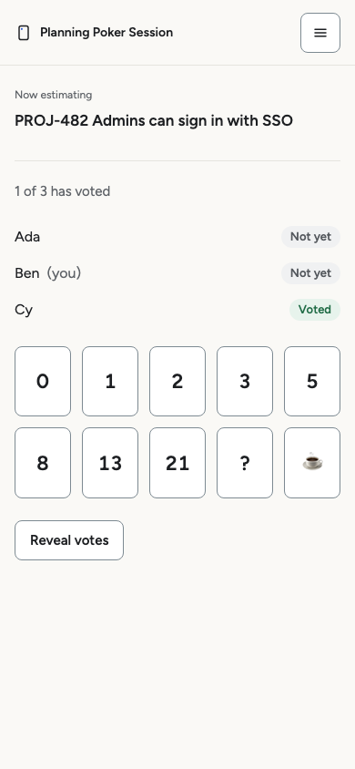</td><td width="45%">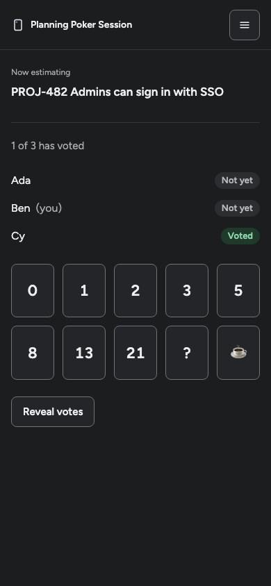</td></tr></table>

What the room is estimating, first in the action row, so nobody has to ask "which one are we on?".

- **For everyone, the same:** "Now estimating" (12 / 400, Quiet), then the ticket (the Ticket role: 17 / 600 compact, 20 / 600 wide), **on one line, cut short with "…"**. The whole text is in its `title`, so a pointer shows it, and a screen reader always reads all of it: the "…" is only drawn. It stays across rounds until someone edits it, and goes with the room.
- **A paragraph, not a heading.** The status line stays the page's `h1`; a heading above it would put the headings out of order.
- **The slot is always there.** In wide it keeps its 56 px, empty, for a participant while there is no ticket: no label, nothing to read, but the action row keeps its height. On a phone an empty slot takes no space.
- **Facilitator view, with Ticket name on:** a quiet, square 28 px pencil button beside the ticket, named "Edit the ticket", which is also its tooltip; with no ticket, a quiet 28 px **Add a ticket** button with a plus, under the label. Either opens editing inside the same 56 px row: the label, then a 40 px field (16 / 600, labelled "Now estimating", `maxlength` 120), **Save** (28 px, primary) and **Cancel** (28 px). While focused, the field's own border turns Cobalt and thicker, inside it: the usual ring outside would cover the label above. Enter saves, Escape cancels, and focus returns to Edit; the Edit and Add a ticket button is one element, so focus stays on it when the saved ticket arrives. Saving an empty field removes the ticket.
- **Said once when someone else changes it,** through the room's polite live region: "Now estimating: PROJ-482 …". Your own Save says nothing: you just typed it. Clearing the ticket says nothing either, deliberately: nobody needs to hear that there is no ticket.
- **Server rules** (`setTicket`, the same checks as every command): runs of whitespace become one space, other control characters go, the ends are trimmed; empty means no ticket; at most 120 characters after cleaning (`MAX_TICKET_LENGTH`), and the field's `maxlength` matches; the same text again changes nothing. Anyone in the room may set it, like Reveal ([ADR 0005](decisions/0005-anyone-can-reveal.md)): the controls appear only in the facilitator view, with Ticket name on. The text is logged nowhere; the log has the message type only.

### The timer

<table><tr><td>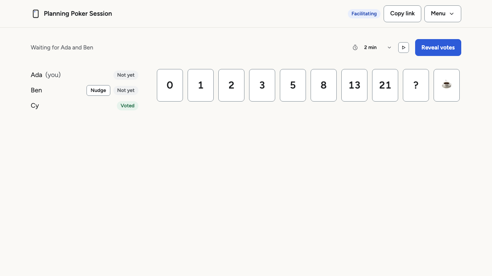</td><td>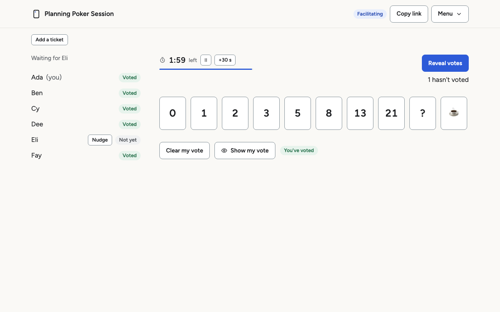</td></tr><tr><td>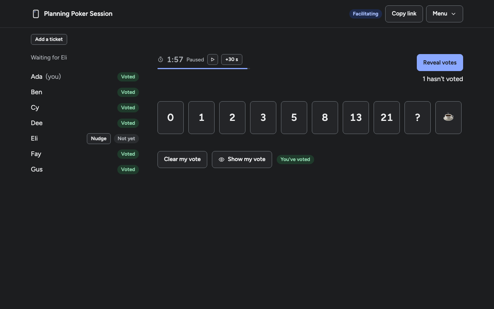</td><td width="45%">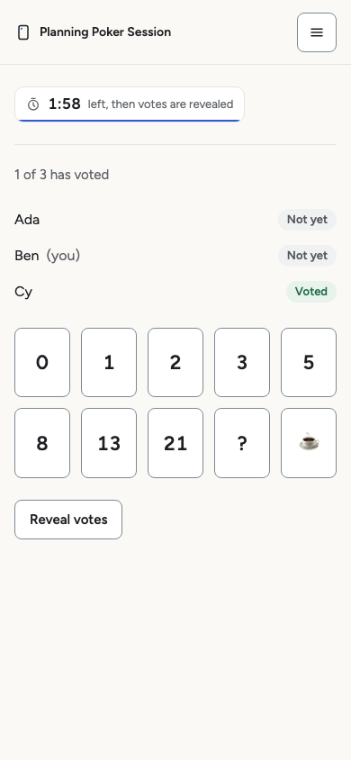</td></tr></table>

<table><tr><td width="45%">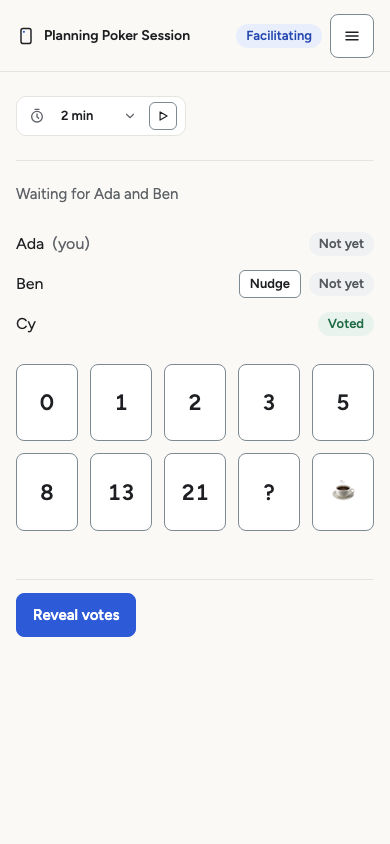</td><td width="45%">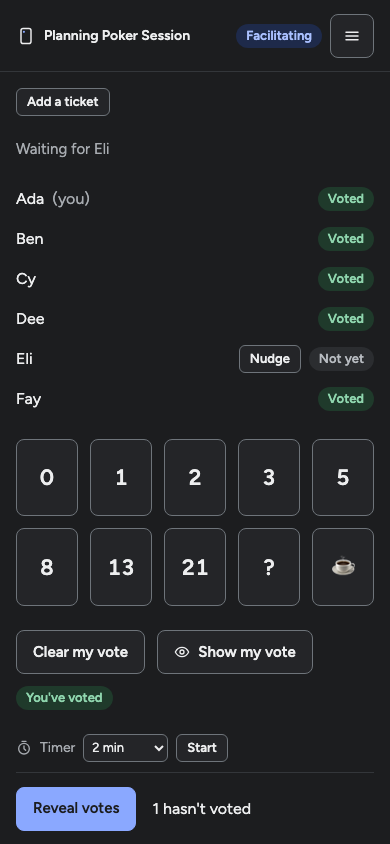</td></tr></table>

A timer for rounds the team wants kept short: the facilitator starts it, everyone sees it, and when it ends the server reveals the votes ([ADR 0008](decisions/0008-the-server-holds-the-timer.md)). Idle until someone starts it.

- **One 40 px block that sits on the page,** in the action row in wide and at the top on a phone: no outline and no fill, the clock at the content's edge. Only its buttons (Start, Pause and Resume, +30 s) have the small button's surface and edge: what is white can be pressed. The time, "Paused" and the duration's select stay plain. **What is left of the duration is its 2 px underline:** a Rule track, filled in Cobalt.
- **Facilitator view, with Timer on, while voting.** Idle: a clock icon (16 px, Quiet), the duration as a quiet select ("1 min ▾", named "Timer": 30 s, 1 min, 2 min, 3 min, 5 min, Custom…), and **Start**, a square 28 px button with a play icon, named "Start the timer". Custom… opens a small m:ss field inside the block, which grows wider, from 0:10 to 10:00. While its text is out of range, Start is disabled, so a timer never starts with a length nobody meant, and once the field is left (or Enter pressed) "Choose a time from 10 seconds to 10 minutes." shows under the action row, in the space above the deck, so it moves nothing, as the field's description. The select shows the room's duration: Custom… whenever it is no preset, whoever set it. Running: the time (17 / 600, tabular numerals; "left" for a screen reader), a square **Pause** button and **+30 s**. Paused: the time turns Quiet, "Paused" appears (13 px, Quiet), and Pause becomes **Resume**. Start, Pause and Resume are one button in one place, so focus stays on it as its job changes; they are named "Start the timer", "Pause the timer" and "Resume the timer", and +30 s "Add 30 seconds". All are the app's small buttons (28 px, the square ones with a 14 px icon), so the block keeps its 40 px when Start becomes Pause, and Reveal votes stays the one strong control.
- **Everyone else, whatever their own settings:** the same block without any buttons, while the timer runs or is paused: "1:24 left, then votes are revealed", or the time, Quiet, and "Paused". Nothing at all while idle.
- **The duration** is the room's, sent the moment it is chosen, and stays across rounds; a running timer keeps its deadline, and a new length applies from the next start. The server accepts 10 s to 10 minutes in whole seconds.
- **Back to idle by itself** at every reveal (a person's or the timer's) and at Start next round.
- **Said once each,** through the room's polite live region: "Timer started: 1 minute."; "10 seconds left." (only if more than 10 seconds were left when it started or resumed, so it never talks over "Timer started"); when the timer reveals, "Time's up." before the result; and when it runs out with nobody having voted, so nothing is revealed, "Time's up. Nobody has voted yet." The countdown itself is never said, and the edge is hidden from screen readers: the time says it.
- **The time** is in tabular numerals, rounded up, so 0:00 shows only at the end. Each browser counts down from the server's deadline, moved into its own clock on arrival, so a laptop whose clock is off still shows the same time as everyone else. With reduced motion the edge jumps rather than slides.

### Keeping score

<table><tr><td>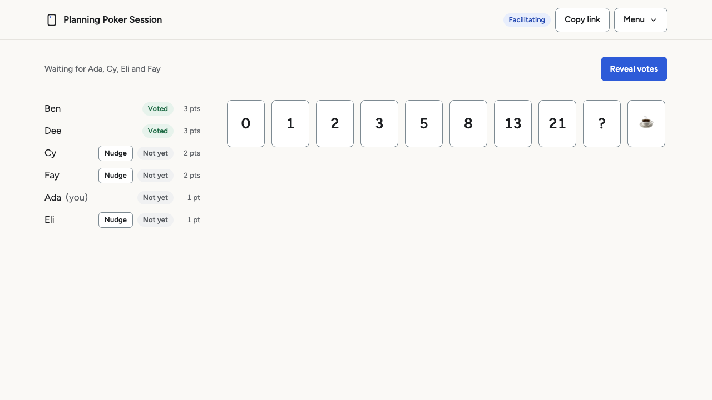</td><td>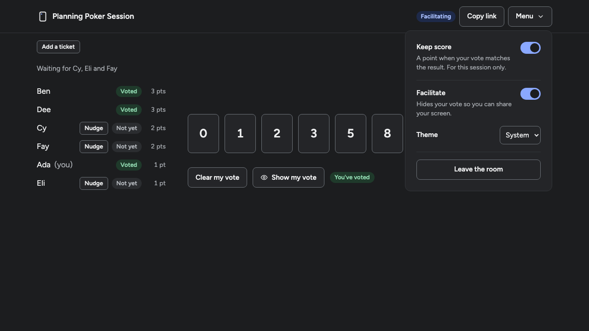</td></tr></table>

A light game some teams like: a point when your vote matches the result. Off until someone turns it on, and for this session only.

- **The switch:** "Keep score" in the Menu's Session tools, after Ticket name and Timer, with the note "A point when a vote matches the result." Only the facilitator view shows it; the server takes it from anyone in the room, like Reveal ([ADR 0005](decisions/0005-anyone-can-reveal.md)). Unlike Facilitate, Ticket name and Timer, which belong to this browser, it is the room's setting: everyone sees the points at once.
- **Awarding, at each reveal:** if exactly one card wins, by the same rule the result shows ([The winning card](#the-winning-card)), everyone who voted it gets a point. A draw, no result or no votes gives nobody a point; ? and ☕ never win. Every reveal counts, including a second round on the same ticket. Points are recorded at the reveal and never recalculated: someone leaving afterwards changes nobody's points. The points are part of the reveal's one change, so the room's version still goes up once, and with scoring off a reveal is exactly what it was before.
- **Seats:** someone who reconnects within the grace period keeps their points; someone removed from the room loses them; a newcomer starts at 0. Nothing is ever stored: the points go with the room.
- **Off keeps them:** turning it off hides the points and keeps them; on again shows them as they were. While it is off, no score is sent at all (the snapshot's `scores` is null).
- **On screen:** the people list, and the revealed list in wide, are in points order, most first, ties in join order, so the order changes only at a reveal. Each row ends with its points, in a 40 px right-aligned column, 13 px, Quiet, tabular numerals: "3 pts", "1 pt" on screen, "3 points", "1 point" for a screen reader.

### Room status

The room's `h1`, styled quiet (15 px, Quiet). "Waiting for Ben and Cy. Fay is away." (facilitator), "4 of 5 have voted" (participant), "Votes revealed".

## Who the round waits for

**People who are away and have not voted do not hold up the round:** the status line counts everyone connected plus anyone away who has voted, and lists the away non-voters separately ("Waiting for Cy. Fay is away."; "Everyone has voted. Fay is away."; "4 of 5 have voted"). Nobody waits on a closed laptop. Grace removal still keeps an away participant's seat for 60 seconds, so if they come back and vote, they count again. This is purely how the snapshot is presented; the server does not change. It is a plain, tested view function.

## The facilitator view

<table><tr><td></td><td>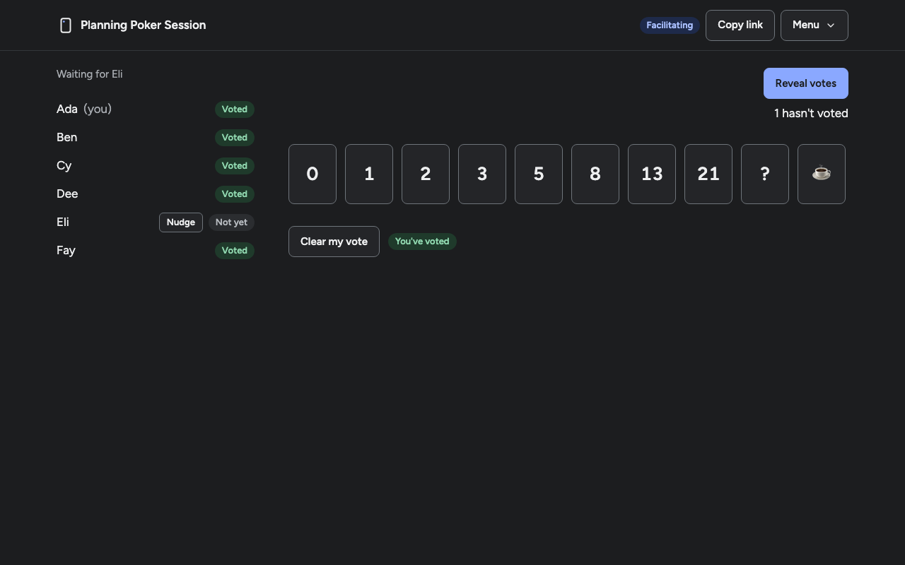</td></tr></table>

<table><tr><td width="45%">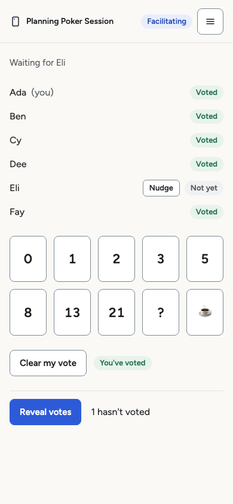</td><td width="45%">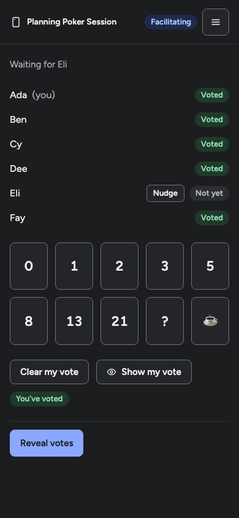</td></tr></table>

A per-person view, not a role, so the server does not change and anyone can still reveal and reset ([ADR 0005](decisions/0005-anyone-can-reveal.md)).

- **The switch.** "Facilitate" in the header's Menu, remembered per browser in `localStorage`, because the same person usually runs every session; on the landing and join pages it is "I'm running this session". It is **off** until someone turns it on, because most people in a room aren't facilitating: whoever runs the session turns it on once, and the browser remembers. (Until v0.2.1 it started on when creating a room; the stored setting moved to a new key then, so everyone starts from off.) While it is on, the header shows the "Facilitating" pill. Its description reads: "Hides your vote so you can share your screen."
- **Controls up front.** "Reveal votes", then "Start next round", as the primary action, always in the same place: at the end of the action row in wide, pinned to the bottom in compact when the window is tall enough (at least 25em; below that, as at 400% zoom, the bar would take a third of the screen, so it sits in the normal flow). In the participant view the same controls are quieter secondary buttons.
- **The controls come last in the DOM.** In compact that matches the pinned bar; in wide they sit top right but come last in keyboard order, which still follows the task (read the status, see who is in, vote, then reveal): WCAG asks for a meaningful focus order, not a strictly visual one.
- **The status line names who is missing** ("Waiting for Ben and Cy. Fay is away.") rather than counting, because that is what the facilitator says aloud.
- **No confirmation on reveal.** A calm, fast tool does not add friction.
- **Per browser, so design for the surprise.** Someone who facilitated yesterday may join as a participant today, click a card, and see no selection. The "Facilitating" pill in the header and the "You've voted" pill make it obvious they are in the facilitator view.

**Your own vote, before reveal:**

- No card shows as selected, visually or in accessibility state. The deck looks and reads the same whether you have voted or not.
- After voting: **Clear my vote**, **Show my vote**, then the green "You've voted" pill, in that order, so the pill does not sit beside the other status pills and read as one of them. Before voting: nothing; your row shows "Not yet".
- The confirmation carries no value, and "Clear my vote" says nothing about what is being cleared.
- **Show my vote** is for the facilitator who wants to check their own card. Pressed, the pill reads "Your vote: 8" (☕ and ? read as "coffee" and "question mark") and the button becomes **Hide my vote**. The deck still marks no card. It hides itself again on a new round, on Clear my vote, when Facilitate is switched off or on, and on a reload: it is this screen's own state, never stored and never sent. The server already sends each person their own vote ([ADR 0004](decisions/0004-vote-privacy-via-projection.md)); keeping it off the facilitator's screen is this view's own rule, above. The button's words change, so it has no `aria-pressed`, and focus stays on it; its eye icon is hidden from screen readers.

<table><tr><td>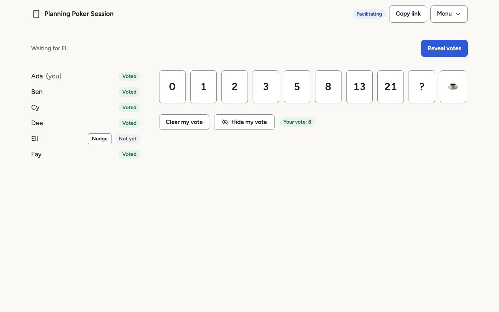</td><td>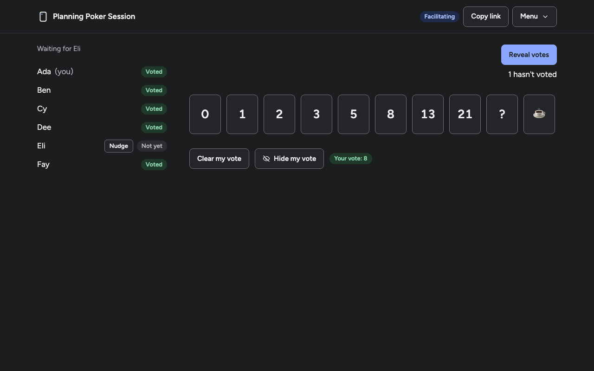</td></tr></table>
- **After Clear my vote, focus goes to the deck's Tab stop,** the first card (this view never marks one). Clearing removes the button that had focus, and choosing a card is the next thing to do.

**Accepted consequence of removing the hidden-vote field.** The facilitator votes by clicking a card on the shared screen, so the team can see the pointer move to a card at the moment of voting. Nothing on screen shows the vote afterwards. This is a deliberate trade of a short, visible moment for less clutter, decided by the team. The screen-level no-leak test stays.

## The result

### The winning card

The team's own rule, and it decides the highlight:

1. Take the numeric votes only. `?` and ☕ never win.
2. If every numeric vote is the same number (at least two of them), that card wins. Nothing needs dropping.
3. Otherwise, with **four or more** numeric votes, drop **one** vote at each end: one vote on the lowest card and one on the highest. Other votes on those cards stay. With two or three, drop nothing.
4. Among the remaining votes, the card with the most votes wins, **if it has at least two**. Two or more cards tied on that count are a draw. If the top count is one, or nothing remains, there is no winner.

| Votes              | After dropping one at each end | Outcome                                     |
| ------------------ | ------------------------------ | ------------------------------------------- |
| 5, 8, 8, 8, 13     | 8, 8, 8                        | 8 wins                                      |
| 3, 3, 3, 5, 8      | 3, 3, 5                        | 3 wins                                      |
| 2, 3, 3, 5, 5, 13  | 3, 3, 5, 5                     | Draw: 3 and 5                               |
| 2, 2, 8, 8, 13, 13 | 2, 8, 8, 13                    | 8 wins (a three-way tie before dropping)    |
| 3, 3, 8, 13        | 3, 8                           | No winner (3 had two votes before dropping) |
| 3, 5, 5, 8         | 5, 5                           | 5 wins                                      |
| 13, 13, 5          | (three votes: nothing dropped) | 13 wins                                     |
| 3, 5, 8            | (three votes: nothing dropped) | No winner (one vote each)                   |
| 2, 3, 5, 8, 13     | 3, 5, 8                        | No winner                                   |
| 5, 8               | (two votes: nothing dropped)   | No winner                                   |
| 5, 5, 5, 5, 5      | (all the same)                 | 5 wins, everyone agrees                     |
| 5, 5, 5, ?         | (all numbers the same)         | 5 wins                                      |

The scale doesn't mark which votes were dropped: the names stay above their cards, and only the winner is tinted.

**Changed after v0.1.0 (2026-09-29):** dropping now starts at four numeric votes (`DROP_ENDS_FROM` in `src/shared/rules.ts`). The rule was written for the team's usual size, around 12. Applied to a round of three, it threw away a third of the votes: 13, 13, 5 lost a 13 and had no result. That's no difference for the team, but a small team, or a public user, would see a rule that never gives a result. With four or more votes nothing changes. A reveal with no result now also says why, in the rule's own terms, instead of leaving only the spread.

**Results model.** The server computes `winners: NumericCard[]` in `computeResults`: one card for a winner, several for a draw, empty for none, by the rule above. The client renders; the server decides what "winner" means, with one tested definition. `outliers` and `wideSpread` are gone, since nothing displays them. `min`, `max`, `spreadSteps`, `consensus` and the distribution stay.

### Highlight and sentence

<table><tr><td>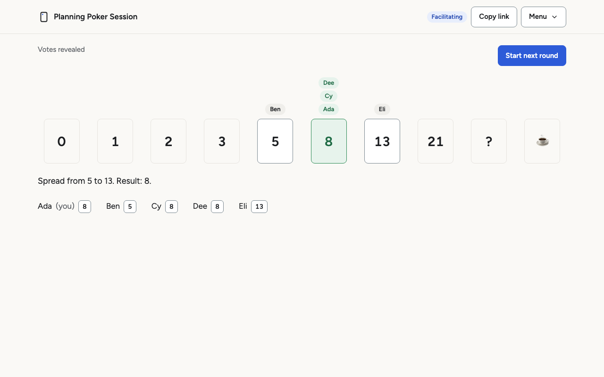</td><td></td></tr></table>

<table><tr><td>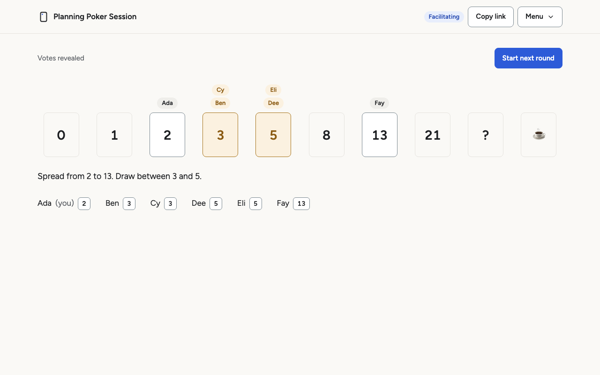</td><td>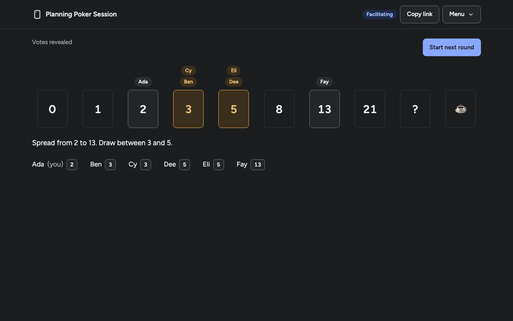</td></tr></table>

<table><tr><td>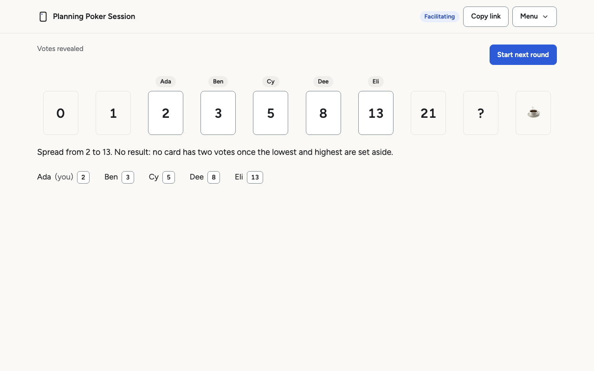</td><td>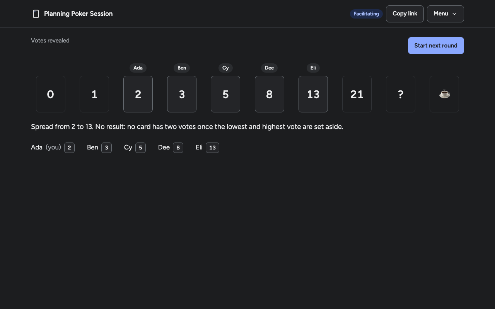</td></tr></table>

| Situation                                                      | Highlight                 | Sentence                                                                                                |
| -------------------------------------------------------------- | ------------------------- | ------------------------------------------------------------------------------------------------------- |
| Everyone voted the same number, at least two votes             | That card, Win (green)    | "Everyone chose 5."                                                                                     |
| Every numeric vote is the same number, with a `?` or ☕ beside | That card, Win            | "Result: 5."                                                                                            |
| A winner                                                       | That card, Win            | "Spread from 5 to 13. Result: 8."                                                                       |
| A draw                                                         | Those cards, Draw (amber) | "Spread from 2 to 13. Draw between 3 and 5."                                                            |
| No winner, four or more numeric votes                          | None                      | "Spread from 2 to 13. No result: no card has two votes once the lowest and highest vote are set aside." |
| No winner, two or three numeric votes                          | None                      | "Spread from 3 to 8. No result: no card has two votes."                                                 |
| A single vote                                                  | None                      | "Only one vote: 8."                                                                                     |
| A single numeric vote, with a `?` or ☕ beside it              | None                      | "Only one numeric vote: 8."                                                                             |
| No numeric votes                                               | None                      | "No numeric votes this round."                                                                          |
| No votes (everyone who voted has left)                         | None                      | "Nobody voted this round."                                                                              |

- **"Result", not "Most votes".** With the dropping rule the winner can differ from the card with the most raw votes (2, 2, 8, 8, 13, 13), so "most votes" would sometimes be untrue.
- The spread is always the full range of all numeric votes, dropped ones included. It appears only when the lowest and highest differ.
- It never names a person. A three-way draw reads "Draw between 2, 3 and 5."
- The sentence is Ink; the colour is on the scale.

## Nudges

<table><tr><td>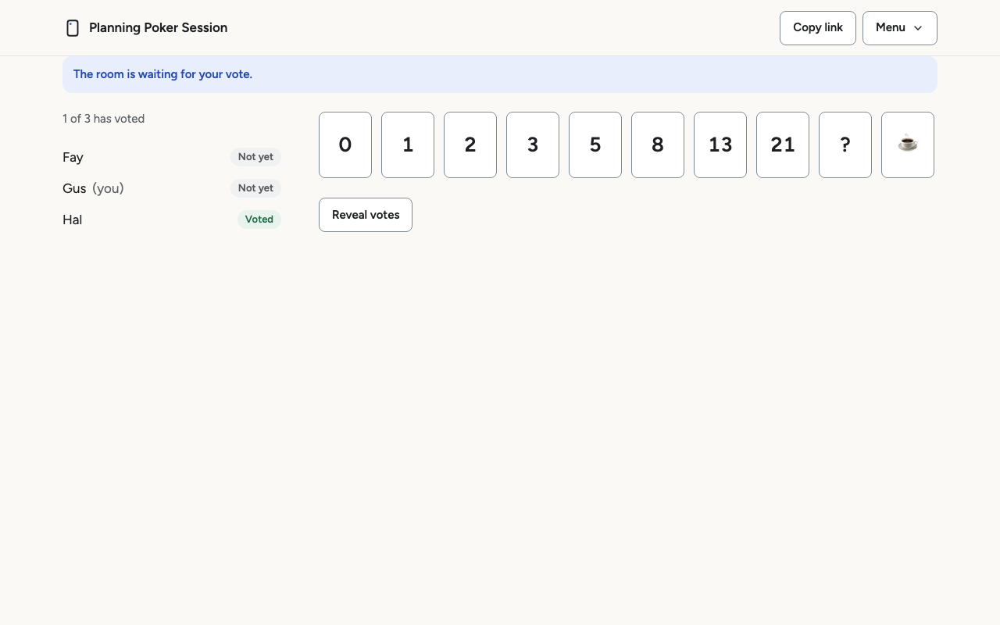</td><td>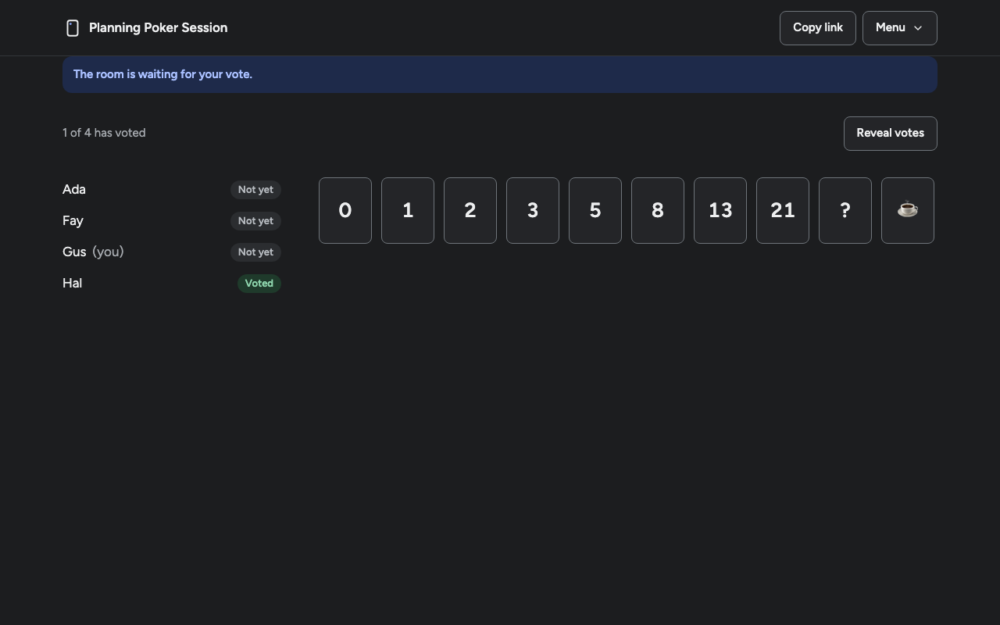</td></tr></table>

A facilitator can nudge someone who hasn't voted, so nobody has to say a name aloud on the call.

- **The banner and the tab title come from one function** (`roomTitleAndBanner`), chosen by a yes or no from fixed words, so they cannot disagree and no name can reach them. The banner's live region is always in the page, empty until a nudge, so its appearing is spoken.
- **As the recipient sees it:** a banner above the room's heading, "The room is waiting for your vote.", in the Facilitating colours with 12 px corners and `role="status"`. It is anonymous: it never says who nudged. The tab title becomes "Your vote, please – Planning Poker Session", visible from another tab. Both clear when the person votes, when the round is revealed or reset, or when they leave. No sound and no system notification in v1.
- **Protocol.** Client message `{ "type": "nudge", "participantId": "<public id>" }`, the id every snapshot shows (16 base64url characters); server message `{ "type": "nudged" }`, sent only to the target and carrying nothing else. Old clients ignore unknown server message types (#20), so no protocol version bump is needed.
- **Server rules,** in the room service; a nudge is transient and never enters room state:
  - The sender must be joined, and the target must be someone else in the same room who is connected and has no vote, while the room is voting.
  - At most one nudge per target every 30 seconds, whoever sends it; the cooldown ends early when that person votes or leaves, or the round ends, the moments the "Nudged" button comes back, so the button and the server always agree. The number is `NUDGE_COOLDOWN_MS` in `src/shared/rules.ts`, the one definition the server's cooldown and the client's "Nudged" button both use. The cooldown map is pruned by the sweep, counted in `bookkeeping()` and covered by the leak test.
  - A nudge that fails a rule is ignored and logged at info, with no error to the sender: a race such as "Cy voted a moment ago" is harmless.
  - Nudges will count toward the per-connection message limit in [#16](https://github.com/ekutnik/planning-poker/issues/16) like any other message; that limit is not built yet, and until it is, the cooldown is what bounds them: one per person every 30 seconds, however many send.
- **Roles.** Consistent with ADR 0005: anyone can technically nudge; the button appears only in the facilitator view. Recorded as [ADR 0007](decisions/0007-nudges-are-transient-and-anonymous.md), "Nudges are transient and anonymous".

## Screens outside the room

### Landing (create)

<table><tr><td></td><td>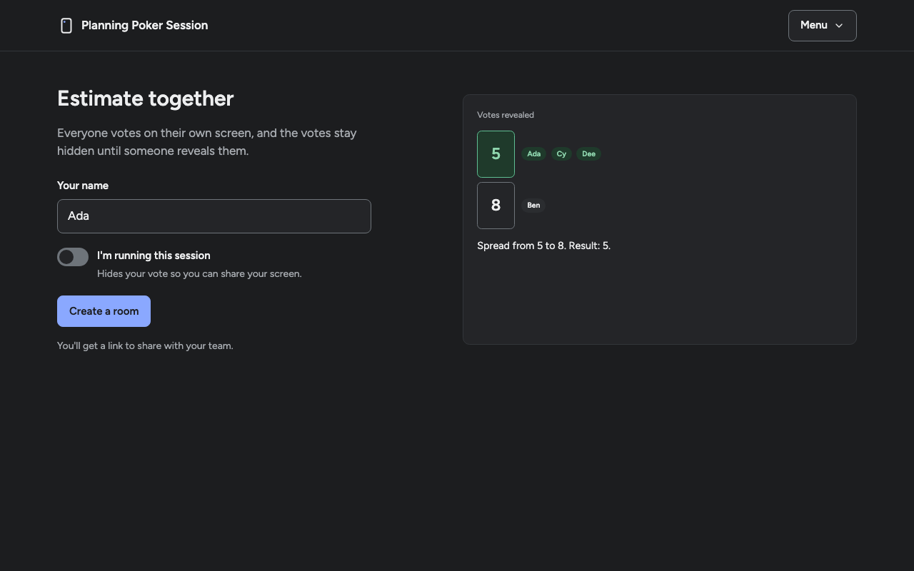</td></tr></table>

<table><tr><td width="45%">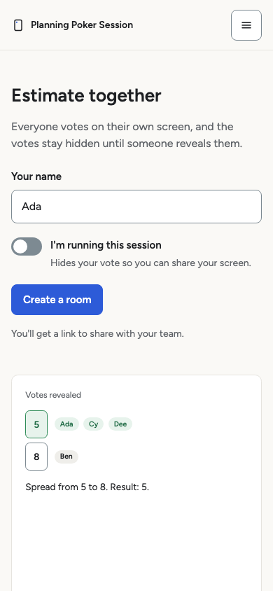</td><td width="45%">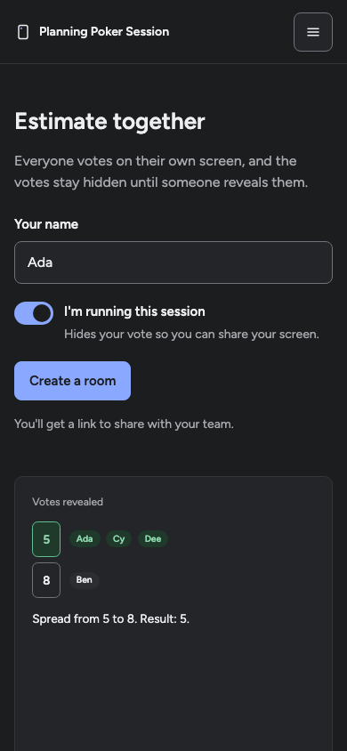</td></tr></table>

Two columns in wide, stacked in compact:

- **Left:** "Estimate together"; "Everyone votes on their own screen, and the votes stay hidden until someone reveals them."; "Your name" (no hint underneath); the switch "I'm running this session", **off** by default, with "Hides your vote so you can share your screen." on one line; **Create a room**; "You'll get a link to share with your team."
- **Right** (below in compact): a looping preview of one round, hidden from screen readers, with **Pause preview** / **Play preview**. With reduced motion it shows its revealed frame, still.
- No autofocus on the name field: the focus rule leaves a fresh load alone.
- **The switch saves on submit.** Both forms start as this browser last left the switch, off if it never chose. Creating or joining saves the switch's value, as the Menu's Facilitate would. So whoever runs the sessions switches it on once, and from then on gets the facilitator view in every room they create or join, including the same room link sprint after sprint.

**How the preview is built.** It is not a video: a script of five fake rooms (Ada has voted, the others vote one by one, then the reveal; about ten seconds) drawn by the room's own `People`, `Deck` and `Scale`, with the real status line and result sentence. So it follows the theme and the tokens, and cannot drift from the room.

- **Out of the way:** the fake room is `inert` and `aria-hidden`, so nothing in it takes focus, a click, or a screen reader's attention. Pause preview, outside it, is the one control. A test renders every frame and fails if anything focusable sits outside the inert room but Pause.
- **Pause** stops on the frame showing; **Play** carries on from there. With reduced motion there is nothing to pause: the revealed frame shows, still, and there is no button.
- **At 80%,** through CSS `zoom`, so the real components shrink as a whole. Its height is held by its tallest frame, drawn invisibly in the same place, so the form beside it and Pause below it never move as it plays.

### Join (from a link)

<table><tr><td>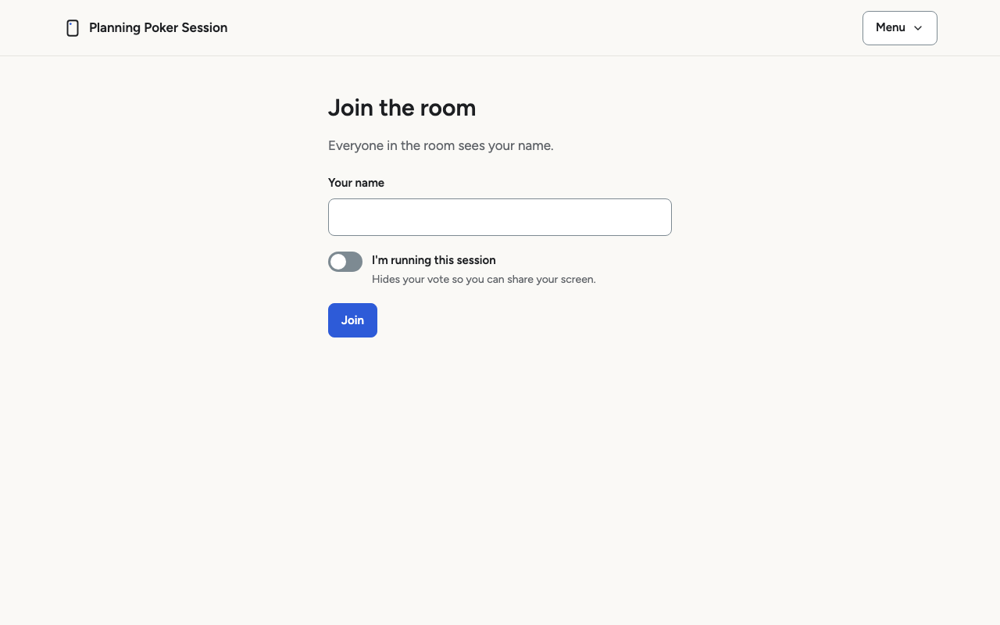</td><td>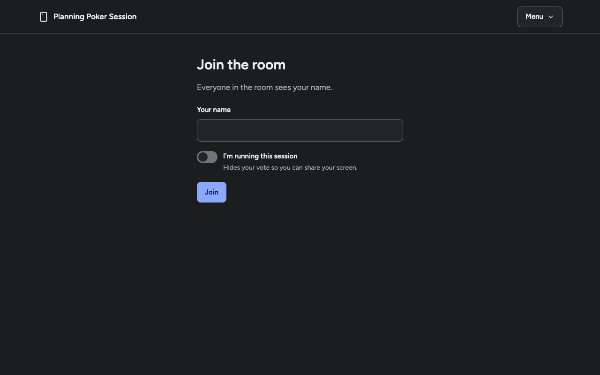</td></tr></table>

One centred column, no preview: "Join the room"; "Everyone in the room sees your name."; "Your name"; the same switch, **off** by default; **Join**.

### Stopped screens and "no room here"

<table><tr><td>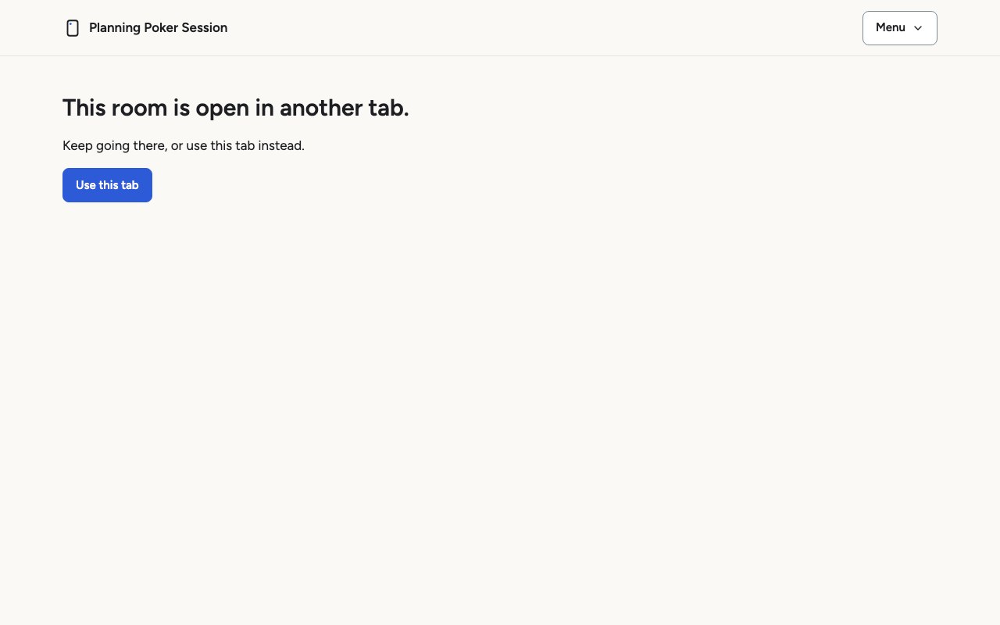</td><td>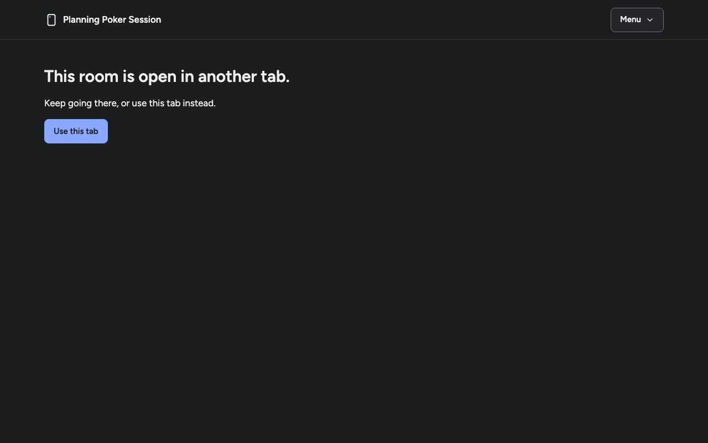</td></tr></table>

The same header, one heading, a sentence or two, and one Cobalt action. An invalid name is said in words below the field, and the outline turns Ink to agree. Each stopped screen says what happened and offers exactly one way on, as a button: nothing retries on its own.

## Motion

| Motion                   | Duration                                    |
| ------------------------ | ------------------------------------------- |
| Card hover lift          | 120 ms                                      |
| Card press               | 80 ms                                       |
| Menu open                | 120 ms fade                                 |
| Between screens          | 150 ms fade                                 |
| Names settling at reveal | 180 ms                                      |
| Landing preview          | A loop of one round, about 10 s, with Pause |

No flip and no rolling counts. Nothing moves because of someone else's action except the reveal settle and the nudge banner appearing (the banner itself does not animate). With reduced motion, nothing moves.

- **Between screens** means a page outside the room, or the room itself: landing to room, room to a stopped screen. The reveal is not one: it is a change of phase inside the room, with its own motion, the names settling, and one moment moves at a time. So the fade sits on the room's `main`, which both phases share, never on the round inside it, which a change of phase replaces.
- **The preview loop is played by script, not CSS,** so the CSS motion test has nothing to exempt. Its own tests hold the rest: it never moves with reduced motion, and it has Pause.

## Copy

Each action keeps one name through the whole flow. The rules, checked by `copy.test.ts`:

- Say what happened and what to do, without apologising.
- Sentences end with a full stop, including a heading that is one ("You left the room."). Labels do not: buttons, and headings that name a place ("Join the room").
- Contractions, as in "You've voted" and "hasn't voted": "couldn't", never "could not".
- One name per thing: it is a room, not a game; you choose a card, not pick one; "Create a room" everywhere; "Start next round", never "new round"; and anyone can reveal, so nothing says "until everyone reveals".
- The result names no one.

| Moment                | Copy                                                                                                               |
| --------------------- | ------------------------------------------------------------------------------------------------------------------ |
| Product name          | "Planning Poker Session"                                                                                           |
| Landing               | "Estimate together"; "Create a room"; "You'll get a link to share with your team."                                 |
| Switch                | "I'm running this session" / "Hides your vote so you can share your screen."                                       |
| Room link, no name    | "Join the room"; "Everyone in the room sees your name."; "Join"                                                    |
| Not a room            | "There's no room at this link."; "Create a room"                                                                   |
| Menu                  | "Session tools"; "Just for you"; "Facilitate", "Theme", "Leave the room"                                           |
| Session tools         | "Ticket name" / "Show what the room is estimating."; "Timer" / "Reveal the votes when time runs out."              |
| Timer, held on        | "Available once the timer has stopped."                                                                            |
| Header pill           | "Facilitating"                                                                                                     |
| Pills                 | "Voted", "Not yet", "Away", "You've voted"; after reveal, "No vote"                                                |
| Own row               | "(you)"                                                                                                            |
| Status (participant)  | "4 of 5 have voted", or "Everyone has voted"                                                                       |
| Status (facilitator)  | "Waiting for Ben and Cy. Fay is away.", or "Everyone has voted. Fay is away."                                      |
| Primary actions       | "Reveal votes" → "Votes revealed"; "Start next round"                                                              |
| Own vote, facilitator | "Clear my vote"; "Show my vote" / "Hide my vote"; "You've voted" / "Your vote: 8"                                  |
| Ticket                | "Now estimating"; "Add a ticket", "Edit the ticket" (the pencil's name and tooltip), "Save", "Cancel"              |
| Ticket (spoken)       | "Now estimating: PROJ-482 …", when someone else changes it                                                         |
| Ticket too long       | "That ticket is too long. Keep it to 120 characters."                                                              |
| Keep score            | "Keep score" / "A point when a vote matches the result."                                                           |
| Points                | "3 pts", "1 pt" (spoken "3 points", "1 point")                                                                     |
| Timer                 | "Timer"; "Start the timer"; "1:24" / "Paused"; "+30 s"; "Custom…"                                                  |
| Timer, others         | "1:24 left, then votes are revealed"; "1:24" "Paused"                                                              |
| Timer (spoken)        | "Timer started: 1 minute."; "10 seconds left."; "Time's up." before the result; "Time's up. Nobody has voted yet." |
| Timer, bad duration   | "Choose a time from 10 seconds to 10 minutes."                                                                     |
| Nudge                 | "Nudge" (accessible name "Nudge Cy"), "Nudged"; "The room is waiting for your vote."                               |
| Result                | See [highlight and sentence](#highlight-and-sentence); the winner line is "Result: 8."                             |
| Link                  | "Copy link" → "Link copied", or "Couldn't copy. Copy the address from your browser."                               |
| Preview               | "Pause preview" / "Play preview"                                                                                   |
| Next round (spoken)   | "Next round started."                                                                                              |

Removed in the revision: "Your first name is enough.", "Your vote (hidden)", "Vote recorded", "Not a card on the deck", "Close: 3 and 5.", "All numbers agree: 5.", "Only Ada voted: 8.", "Only Ada chose a number: 8.", every "…, talk through your estimates." and "Cy voted ?".

## Accessibility, built in

Checked against WCAG 2.2 AA in September 2026: a self-audit, not an outside one. The record, with what was and wasn't tested, is in [`docs/audit/2026-09-accessibility.md`](audit/2026-09-accessibility.md); the checks still due before launch are in [#44](https://github.com/ekutnik/planning-poker/issues/44).

- **The deck is a toolbar of toggle buttons,** described under [Deck](#deck-voting).
- **Reveal is announced** through a polite live region: "Votes revealed." followed by the sentence, range included, because someone who cannot see the scale needs the numbers. It does not list the non-numeric votes: the scale itself is a list a screen reader can read ("question mark: Cy"). On that list, the cards nobody chose are hidden from screen readers, which hear only the cards that were chosen, each with its names; on screen they stay, so the gaps still show the spread (decided after the VoiceOver check in #44). The person whose focus moved to the new heading has just heard "Votes revealed" from it, so their announcement gives only the sentence; everyone else hears it whole. The new heading reports whether it took focus, and only then is the text chosen.
- **The next round is announced too:** "Next round started.", whoever pressed the button, because the scale giving way to the deck is a big change caused by someone else. Only changes of phase are announced: not joining a room in either phase, and not later snapshots within one.
- **Focus survives a screen change,** with one rule: when a new screen replaces the one that had focus (reveal, "Start next round", joining a room, a stopped screen), its heading takes focus, so a screen reader reads where you are and the keyboard starts from there. A heading is not a control, so a stray Space or Enter cannot start a round. Focus still on the page stays where it is, and a fresh page load is left to the browser.
- **The voted count is visible but not announced** on every change, which would make a screen reader chatter through the whole discussion.
- **Selection and focus look different,** so a keyboard user can tell "this is my vote" from "this is where I am". Selected: a Cobalt fill with an On Cobalt numeral. Focused: the 3 px Cobalt ring, 2 px outside the card's edge. A selected card with focus shows both.
- **Every control shows the focus ring** when reached from the keyboard, and every target is at least 24×24 CSS px (WCAG 2.5.8).
- **In Safari, Tab moves only between text fields by default;** Option+Tab reaches every control, or all of them with Tab once "Press Tab to highlight each item" is on (Safari's Advanced settings). That is Safari's behaviour, not a bug here: the end-to-end suite presses Option+Tab in WebKit. Safari also doesn't focus a button on a mouse click, so after mouse-only use nothing has had focus, and a screen change leaves focus where it is, as the focus rule says.
- **Status is a word:** each pill says Voted, Not yet or Away, so colour is never the only signal.

## Reviewed against the brief

The first design's instincts, and what they became:

| First instinct                       | Changed to                                             | Why                                                                                               |
| ------------------------------------ | ------------------------------------------------------ | ------------------------------------------------------------------------------------------------- |
| Card-flip animation on reveal        | Names settle onto the scale once                       | Flipping is the stock planning-poker effect, the drama this rejects. Settling shows what changed. |
| A results card with big stat numbers | Results on the deck itself, plus one sentence          | Big stat tiles are the dashboard default, and the results model has no median.                    |
| A blueprint-blue background          | Quiet paper; the drafting idea lives only in the scale | Too literal and too loud for "calm".                                                              |
| Every section in a rounded box       | Space between sections; only the cards are outlined    | The generic card kit.                                                                             |
| A single narrow column               | Two layouts, switched by width                         | A full desktop window deserves the width; the scale benefits most.                                |
| Sizes chosen for one person's screen | Wide sizes chosen for a screen-share thumbnail         | The facilitator's screen is the team's shared view.                                               |
| A highlighted own vote everywhere    | Hidden in the facilitator view                         | A shared screen broadcasts it.                                                                    |

## Tests that prove the properties

- **Screen-level no-leak test,** mirroring the wire-level vote-privacy test: in the facilitator view before reveal, no element shows the viewer's own card (no selected state on any deck card, no card value in any visible text) until they press Show my vote, and the deck never does. Removing the hiding once must fail it.
- **Contrast, two tiers, both themes:** every text pair and every pill at least 4.5:1; Edge (on Paper and Surface), Cobalt and the tinted cards' borders at least 3:1; Rule below 3:1.
- **Type scale:** every role matches the table, compact and wide.
- **Results:** the worked examples of the winning rule and the highlight-and-sentence table, each as an `it.each`.
- **Copy:** the removed strings are gone; the new strings follow the copy rules.
- **Layout:** the scale's names never clip (no `max-height` or fixed height on the name stack); compact renders only voted cards; the facilitator bar is pinned only in compact and only when the window is tall enough.
- **Fixed slots,** in a real browser (`e2e/layout.e2e.ts`): nothing moves, to the pixel, as each tool is switched on and used, for the facilitator and for a participant; every control in the voting and revealed views is 44, 40 or 28 px, as its kind says; the status line's centre is the action row's, within 1 px; the ticket stays on one line, whole in its title and for a screen reader; switching Ticket name off clears it for another browser; Timer is held on while a timer runs or is paused; the timer block has no fill and no outline; Ticket name and Timer are stored under `planning-poker:tools:v1`, and off in a browser that never set them.
- **Motion:** a test reads the stylesheets and fails if anything animates outside `prefers-reduced-motion: no-preference`, or for 200 ms or more; the preview loop is the one exemption, and must have a pause control.
- **Theme:** the no-flash script applies exactly what the app would, for every stored value (unit test); the stored choice is applied before first paint (the end-to-end suite).
- **The end-to-end suite** also covers what static markup cannot: the Menu closes on Escape (with focus back on its button), on a click outside and when focus leaves it, and stays open while Facilitate or the theme changes; in the facilitator view, after a mouse click on a card, tabbing out of the deck and back lands on the first card, not the one clicked, and after Clear my vote focus is on the first card; pressing a hovered card cancels its lift; the reveal and the next round are each announced once, on the change, and the person who revealed hears "Votes revealed" once, not twice; after a screen change (reveal, "Start next round", joining, a stopped screen arriving from another tab), focus is on the new heading; the title follows the round; creating a room with "I'm running this session" on opens the facilitator view, and joining with it off the participant view; the landing preview advances on its own, Pause stops it on the frame showing, and nothing inside it can be reached with Tab or clicked; and a nudge reaches only its target, with the banner and tab title clearing on voting; "Nudged" keeps keyboard focus after Enter, and focus moves to the people list when a focused Nudge button goes; the button comes back after 30 seconds.

## Building the revision

| PR  | Scope                                                                                                                                                                |
| --- | -------------------------------------------------------------------------------------------------------------------------------------------------------------------- |
| #46 | Tokens, Figtree, pill and tinted-card colours, the contrast test extended, and this document                                                                         |
| #48 | Header: mark, favicon, Menu panel, the Facilitating pill                                                                                                             |
| #49 | People list with pills and "(you)", the 4:5 cards and their states, the deck one row wide and five by two compact, the quiet status line, own vote without the field |
| #50 | Results model (`winners`, with the dropping rule), the scale (highlight, stacking, compact voted-only), the sentence, the announcement                               |
| #51 | Landing and join: the switch, the preview loop with Pause, screen fades                                                                                              |
| #52 | Nudge, server: protocol, rules, cooldown, ADR 0007                                                                                                                   |
| #53 | Nudge, client: the button, the banner, the tab title                                                                                                                 |

Each PR includes screenshots in both themes. #49 to #51 and #53 repeat the keyboard-only and 400% zoom checks and add a line to the audit record.
